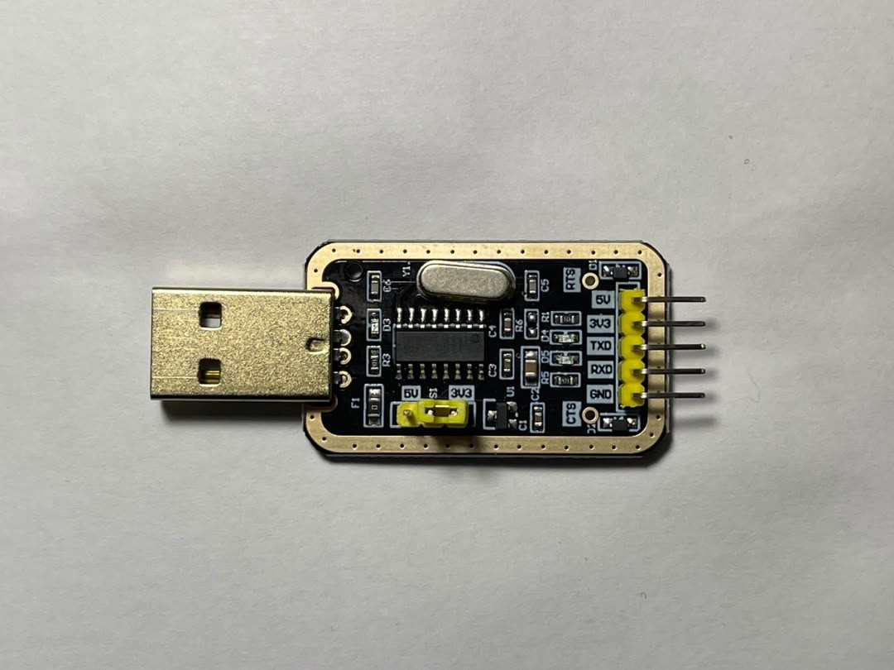
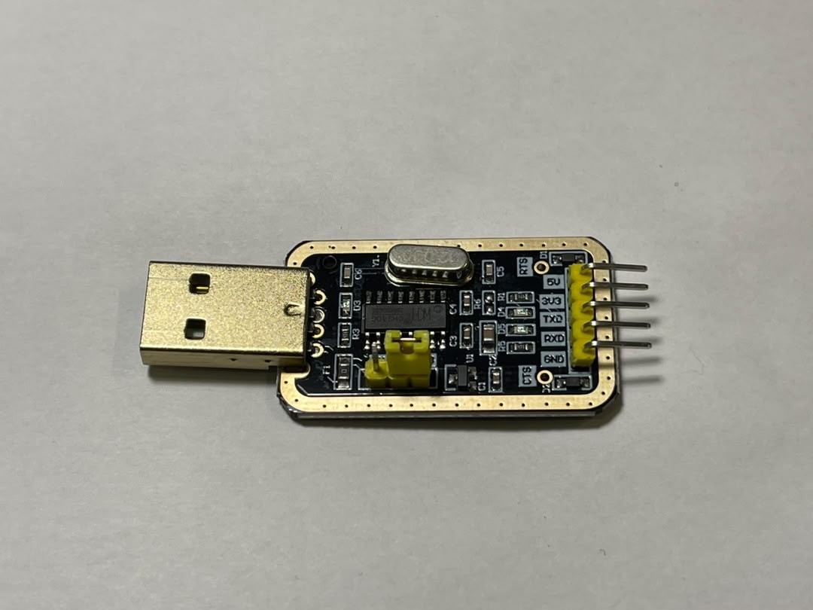
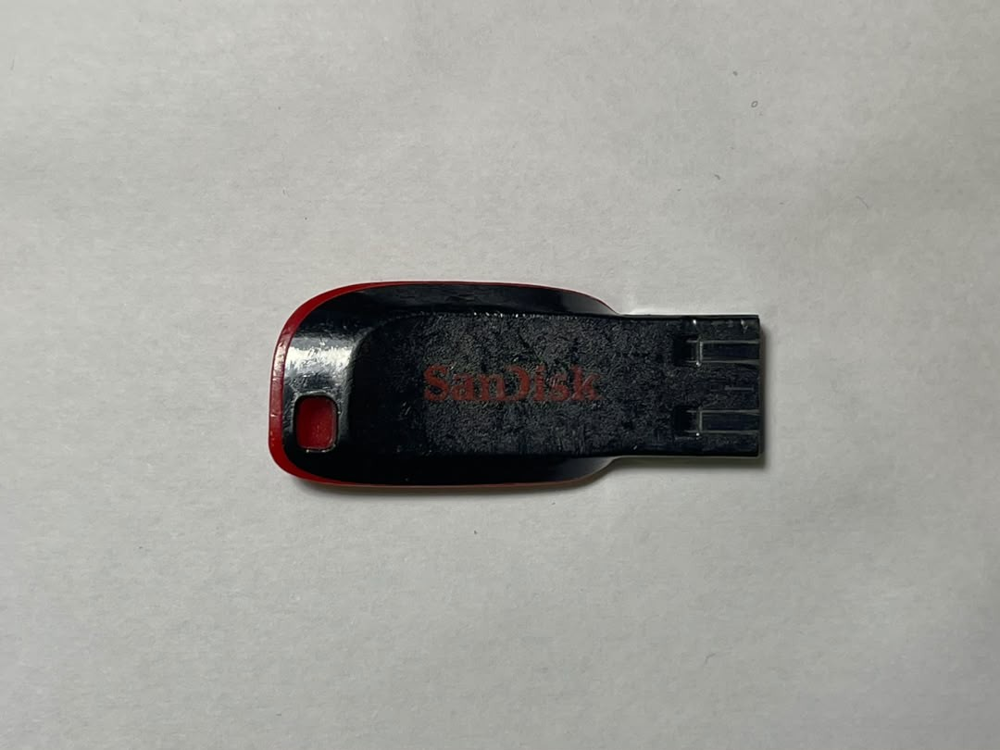
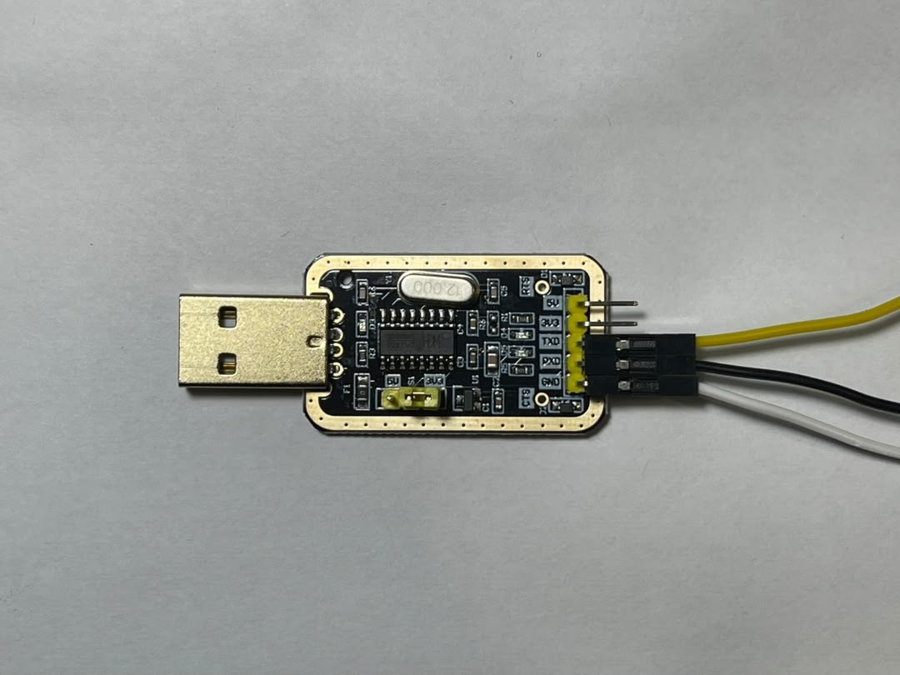
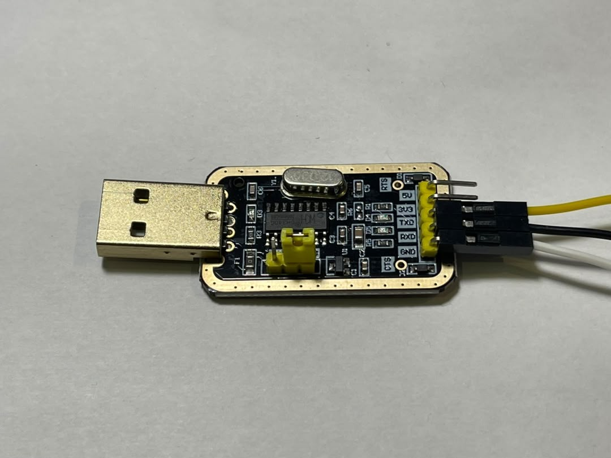
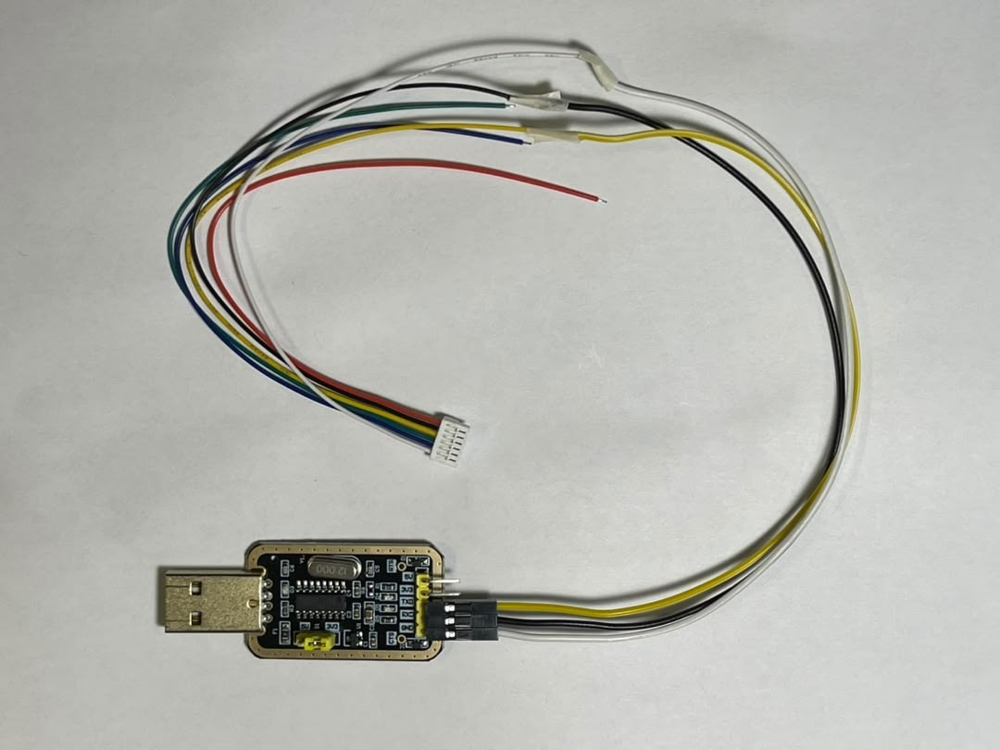

# Build services.jar for ECarX E02 Android 9

Take the stock `services.vdex` off the head unit and turn it into a `services.jar` that allows sideloading — all on your own PC. Pull the file over UART with the factory `su`, convert CompactDex to standard DEX with a small Python tool, change four signature checks, then rebuild.

**IHU:** ECarX E02 · **Android:** 9 · **Pull:** UART + factory su · **Build:** Ubuntu WSL · **Output:** services.jar

---

## Contents

- [Step 0 — Overview](#step-0--overview)
- [Step 1 — Prerequisites](#step-1--prerequisites)
- [Step 2 — Connect UART](#step-2--connect-uart)
- [Step 3 — Pull services.vdex](#step-3--pull-servicesvdex-off-the-ihu)
- [Step 4 — WSL Tools](#step-4--wsl-toolchain)
- [Step 5 — vdex → cdex](#step-5--vdex--cdex)
- [Step 6 — cdex → DEX](#step-6--cdex--standard-dex)
- [Step 7 — DEX → smali](#step-7--dex--smali)
- [Step 8 — Patch 4 Changes](#step-8--patch-the-4-changes)
- [Step 9 — smali → jar](#step-9--smali--jar)
- [Step 10 — Verify](#step-10--verify-before-deploy)
- [Fix Fast](#fix-fast)
- [Project Notes](#project-notes)

---

## Step 0 — Overview

`Read First`

This guide builds the one file that lets you sideload APKs on an ECarX E02 head unit — `services.jar` — **from the unit's own firmware**.

> [!TIP]
> **What makes sideloading work:** Android's installer blocks any APK whose signature does not match the system. Four small changes inside `services.jar` control that check. **Make those four** and the installer stops rejecting APKs signed by someone else. Once you know which four, you can build the file yourself for any firmware version.

**The four changes (all in `PackageManagerService`):**

| Method | Original | Patched to |
|---|---|---|
| `PackageManagerServiceUtils.compareSignatures([Signature;[Signature;)I` | compares two signature sets | `return 0` (SIGNATURE_MATCH) |
| `PackageManagerService.compareSignaturesWithAco([Signature;)I` | ECarX signature check | `return 0` |
| `PackageManagerService.reconcileApps(Ljava/lang/String;)V` | reconcile check on install | `return-void` (no-op) |
| `PackageManagerService.installPackageLI` — aco whitelist branch | rejects any package not on the aco whitelist | redirect all branches past the reject (see Step 8.4) |

In Android, `compareSignatures` returning `0` means "signatures match". Make it always return `0` and the installer stops rejecting APKs that are unsigned or signed by someone else. The other two are backups, so nothing else blocks the install again.

**Why this is harder than it sounds:**

On stock ECarX firmware, `services.jar` is only a 183-byte stub. The real code sits in `services.vdex`, in Android's internal **CompactDex** (`cdex`) format. Normal tools like baksmali cannot read CompactDex, and Google's `compact_dex_converter` needs a full AOSP build to compile. So this guide uses a **small Python converter** instead — no AOSP, and no binaries you have to trust.

**The full flow:**

**Reference** — From the head unit's firmware to a finished services.jar
```text
IHU  services.vdex   ─(UART + factory su, copy to USB)→   your PC
     services.vdex   ─(vdexExtractor)→   services.cdex   (CompactDex)
     services.cdex   ─(cdex2dex.py)→     services.dex    (standard DEX)
     services.dex    ─(baksmali)→        smali/           (editable)
     patch 4 changes ─(smali)→           classes.dex
     classes.dex     ─(zip)→             services.jar     ← done
```

> [!WARNING]
> **Root without unlocking the bootloader:** to read `services.vdex` off the IHU you only need **read** access as root. ECarX leaves a factory `su` at `/system/xbin/su` that gives root to the UART shell. That is all Step 3 uses.

> [!CAUTION]
> **Before you start:** this guide assumes you can already get a UART shell on the IHU (CH340G at 3.3V, PuTTY at 921600). If you cannot, [Step 2](#step-2--connect-uart) sets it up from scratch. Everything else you need is in [Step 1](#step-1--prerequisites).

## Step 1 — Prerequisites

`Hardware + Software`

### 1.1 — Hardware

| Item | Notes |
|---|---|
| CH340G USB-to-TTL adapter | Must be set to **3.3V**, not 5V. 5V will permanently damage the IHU UART pins. |
| Micro JST GH 6-pin cable, single connector | A connector on one end, bare wire ends on the other. GH series is 1.25 mm pitch — a 6-pin cable from any other JST series will not fit the IHU port. Full pinout is in [Step 2](#step-2--connect-uart). **The three wires you do not use must be insulated** — see [Step 2.1](#step-2--connect-uart). |
| Heat shrink tube + heat gun | To cover the bare ends of the blue, green and red wires. Electrical tape works too — just do not leave them bare. [Step 2.1](#step-2--connect-uart). |
| USB drive, **FAT32** | To carry `services.vdex` off the IHU. exFAT and NTFS are not read. |
| Windows PC + Ubuntu WSL | All the conversion and patching work happens in WSL. |
| ~2 GB free disk space | For the vdexExtractor source, the build tools, and the extracted smali files. |

\
*CH340G adapter. The pin header is labelled `5V`, `3V3`, `TXD`, `RXD`, `GND`.*

\
*The yellow jumper selects the voltage. It must sit on **3V3**, never 5V.*

\
*Micro JST GH 6-pin cable, single connector. The connector plugs into the IHU; the bare ends go to the adapter.*

\
*Any small USB-A drive works, as long as it is formatted **FAT32**. It carries `services.vdex` off the IHU in [Step 3](#step-3--pull-servicesvdex-off-the-ihu).*

> [!CAUTION]
> **Before you buy anything else, get heat shrink or electrical tape.** The Micro JST GH cable comes with six bare tinned ends, and you only use three. The other three — blue, green and red — stay live right next to the wires you use, and red carries **3.3V from the IHU** whenever the unit is on. You have to cover them. Full detail in [Step 2.1](#step-2--connect-uart).

### 1.2 — Software on the PC

| Software | Used for |
|---|---|
| PuTTY 64-bit | The serial terminal for UART, at 921600 baud. This is how you pull the vdex in [Step 3](#step-3--pull-servicesvdex-off-the-ihu). Download `putty-64bit-*-installer.msi` from [the official PuTTY download page](https://www.chiark.greenend.org.uk/~sgtatham/putty/latest.html). |
| CH340G driver | So the COM port appears in Device Manager. Get it from the chip maker, WCH: [CH341SER driver](https://www.wch-ic.com/downloads/CH341SER_EXE.html) — the same package covers the CH340/CH340G. |
| Ubuntu WSL | Runs the whole toolchain — see [Step 4](#step-4--wsl-toolchain). Nothing to download: `wsl --install` in [1.3](#step-1--prerequisites) gets it for you. Microsoft's page is [learn.microsoft.com/windows/wsl/install](https://learn.microsoft.com/en-us/windows/wsl/install). |

### 1.3 — Install WSL

Run this in **PowerShell as Administrator**, then restart Windows. Skip it if `wsl -l -v` already lists an Ubuntu distro.

**PowerShell** — Install Ubuntu WSL
```text
wsl --install
```

The build packages themselves — `smali`, `baksmali`, `build-essential` and the rest — are installed inside WSL in [Step 4.1](#step-4--wsl-toolchain). Do not install them yet.

### 1.4 — Files you need

| File | Size | Where it comes from |
|---|---|---|
| `services.vdex` | ~20MB | Pulled off **your own** IHU over UART in [Step 3](#step-3--pull-servicesvdex-off-the-ihu). It has to match the firmware on the unit you are patching. |
| `vdexExtractor` | — | Cloned from GitHub (`anestisb/vdexExtractor`) and built in [Step 4.3](#step-4--wsl-toolchain). |
| `cdex2dex.py` | ~430 lines | Written out by the one-liner in [Step 4.4](#step-4--wsl-toolchain). Nothing to download. |
| `smali` / `baksmali` | — | Ubuntu `apt` package, installed in [Step 4.1](#step-4--wsl-toolchain). |

## Step 2 — Connect UART

`UART · PuTTY`

UART gives you a shell inside the IHU. You use that shell to pull `services.vdex` off the unit in [Step 3](#step-3--pull-servicesvdex-off-the-ihu).

> [!CAUTION]
> **3.3V only.** Check the CH340G is set to 3.3V before you connect anything. 5V will damage the IHU UART pins for good.

### 2.1 — Micro JST GH port pinout

\
*Where to look: the port sits low on the side panel of the chassis. The red **TAP** marking here is hand-written, your unit will not have it.*

\
*The same port up close — six pins in a white housing. Count them against the table below before you push the connector in.*

| Pin | Colour | Function | When used |
|---|---|---|---|
| 1 | White | GND | Always |
| 2 | Blue | Recovery | Short to GND for BROM / recovery |
| 3 | Green | USB | Short to 3.3V to switch the USB port into device mode |
| 4 | Black | UART RX | Always |
| 5 | Yellow | UART TX | Always |
| 6 | Red | 3.3V | Used to short with green |

> [!TIP]
> **You only need three wires for this guide:** yellow, black and white to the CH340G. Green and blue are only for BROM / device mode, which this guide never uses. Leave the green pin un-shorted, or the USB drive in [Step 3](#step-3--pull-servicesvdex-off-the-ihu) will not mount.

> [!CAUTION]
> **Insulate blue, green and red before you connect anything. This is the highest-risk part of the whole guide.** You do not use those three wires here, but they are still connected to the IHU and their ends are **bare tinned copper**. While the unit is on:
>
> - **Red is a live 3.3V rail.** If red touches white (GND) or the adapter's GND pin, it shorts the IHU's 3.3V supply — the worst thing on this list.
> - **Blue is Recovery.** If blue touches GND, the unit drops into BROM / recovery instead of booting normally.
> - **Green is USB mode.** If green touches red, the USB port flips into device mode, and then the USB drive in [Step 3](#step-3--pull-servicesvdex-off-the-ihu) will not mount.
>
> All three ends hang loose right next to the wires you *do* use, and the cable moves every time you reach around the unit. Cover them.

**How to cover them**

| Method | How |
|---|---|
| **Heat shrink tube** (best) | Slide a ~15mm piece of 2–3mm tube over each bare end **one at a time**, then shrink it with a heat gun at about 100–150 °C, a few seconds each, turning the wire as it tightens. Adhesive-lined tube seals best. |
| No heat gun? | Hold the barrel of a hot soldering iron close (not touching), or a lighter a few cm below the tube — keep it moving, and never let the flame touch the tube or the wire. A hair dryer is usually not hot enough for standard polyolefin tube. |
| PVC electrical tape | Wrap each end on its own, two or three turns past the tip, then fold the tip back and tape it down so nothing can poke out. |
| Self-amalgamating silicone tape | Stretch and wrap each end. It fuses to itself and leaves no sticky residue. Good if you will open the cable up again later. |
| Spare dupont housing | Push an empty 1-pin dupont shell, or a short offcut of empty wire sleeving, over each end. Fast, easy to undo, no heat needed. |

> [!WARNING]
> **Cover them one by one, never bundled together.** Taping the three bare ends into one lump is how you short blue to red. One cover per wire.

> [!WARNING]
> **Do not cut them off.** Blue, green and red are the exact wires the [fast-sideload guide](./sideload.md) shorts to enter BROM mode. Cut them and you lose your recovery path — cover them, do not cut them.

\
*The six wire colours, matching the table above: white, blue, green, black, yellow, red.*

### 2.2 — Wire it up and open PuTTY

- Make sure the IHU **POWER socket is unplugged** before you wire anything — that is **Socket Block A — Power**, the black connector at the bottom of the ISO stack

  \
  *The ISO connectors as they normally sit, everything still plugged in.*

  \
  *Unplug the one in the red box: **Socket Block A — Power**, the black connector at the very bottom of the ISO stack.*

- **Check blue, green and red are still covered** — heat shrink or tape intact, no copper showing. Do this every time, not just the first

- Plug the CH340G USB-to-TTL module into the PC, then insert the Micro JST GH cable into the IHU's JST GH port

- Yellow (TX) and black (RX) to the CH340G, white to GND

- Device Manager → Ports (COM & LPT) → find **USB-SERIAL CH340** and write down the COM number

- Open PuTTY → Connection type: **Serial**

- Set **Serial line** to your COMx (the number Device Manager showed)

- 

  **PuTTY** — Set PuTTY Speed (baud rate)
  ```text
  921600
  ```

- Set **Saved Sessions** to **UART**, then click **Save** to keep the settings

- Select the **UART** profile and click **Load**, or just double-click the **UART** profile

- One last look before power: blue, green and red still covered and kept away from the three wires you use

- Click **Open**, then plug the IHU POWER socket back in. The boot log starts scrolling

- Wait for boot to finish, then press **Enter** once to get a prompt

> [!TIP]
> **Tip:** once the **UART** profile is saved, you only need to double-click it next time. Right-click inside PuTTY pastes the clipboard — that is how you paste the commands in the next steps.

\
*Only three wires are used — yellow, black and white — on `TXD`, `RXD` and `GND`.*

\
*Angled view, so you can check each wire against its pin label.*

\
*The finished lead: adapter, three jumpers, and the JST GH cable that plugs into the IHU.*

> [!TIP]
> **The prompt should look like this:**

**Output** — Expected prompt
```text
console:/ $
```

> [!TIP]
> The `$` means you are **not** root yet. That is normal — [Step 3.1](#step-3--pull-servicesvdex-off-the-ihu) runs the factory `su` to fix it.

> [!WARNING]
> **No text at all in PuTTY?** TX and RX are probably swapped — swap those two wires and reconnect. Also check the COM port number, the Serial line, the cable orientation, the CH340 driver, and that the speed is exactly `921600`.

## Step 3 — Pull services.vdex Off the IHU

`UART · PuTTY`

The real framework code sits in `/system/framework/oat/arm64/services.vdex`. We copy it to a USB drive with the factory root shell. Nothing on the device is changed.

### 3.1 — Get root with the factory su

In the PuTTY UART shell the prompt starts as `$` (the shell user). Run the factory `su` by its full path — do **not** type just `su`, that runs MagiskSU, which is not set up here:

**UART** — Factory root
```bash
/system/xbin/su
```

> [!TIP]
> The prompt changes to `#`. That is root. Reading a file only needs root read access.

### 3.2 — Find the file

On a stock IHU the file is `services.vdex`. Check it is there and note the size:

**UART** — Locate the vdex
```bash
ls -lh /system/framework/oat/arm64/services.vdex*
```

> [!TIP]
> You should see `services.vdex`, around **~10MB**.

### 3.3 — Copy it to a USB drive

Plug a FAT32 USB drive into the IHU, find where it mounts, then copy:

**UART** — Copy vdex to USB
```bash
ls /mnt/media_rw/
cp /system/framework/oat/arm64/services.vdex /mnt/media_rw/usbotg-otg1/services.vdex
sync
ls -lh /mnt/media_rw/usbotg-otg1/services.vdex
```

> [!WARNING]
> **USB drive not showing up?** If the JST GH green pin is shorted (device mode), the USB port will not read a drive. Un-short it first, or transfer over ADB/WiFi instead. On a stock unit the port is in host mode by default, so the drive mounts normally. **Check the bare green wire is not touching red** — touching by accident does the same thing as shorting it on purpose ([Step 2.1](#step-2--connect-uart)).

### 3.4 — Move the file onto your PC

Pull the drive out, plug it into your PC, and copy `services.vdex` onto your Desktop. Everything from here on happens in Ubuntu WSL.

## Step 4 — WSL Toolchain

`WSL Ubuntu`

Four tools: `baksmali`/`smali` (to take DEX apart and put it back together), a compiler toolchain to build `vdexExtractor`, and the Python `cdex2dex.py` converter.

### 4.1 — Install the packages

**WSL** — Install tools
```bash
sudo apt-get update
sudo apt-get install -y smali baksmali python3 git build-essential zlib1g-dev zip
```

On Ubuntu the `smali` package gives you both `smali` and `baksmali` (v2.5.x, which handles Android 9 / API 28).

### 4.2 — Set up a working folder

The copy command below reads your Windows Desktop from inside WSL, so it needs your Windows username. List the accounts on the machine:

**WSL** — List Windows users
```bash
ls /mnt/c/Users/
```

Ignore `All Users`, `Default`, `Public` and `desktop.ini`. Those are Windows system entries. Whatever is left is your username.

**WSL** — Set your paths once, at the top of the session
```bash
# Your Windows username — the folder name under C:\Users\
export WINUSER="your-windows-username"

# Pick ONE of these two, depending on whether your Desktop syncs to OneDrive
export DESKTOP="/mnt/c/Users/$WINUSER/OneDrive/Desktop"
# export DESKTOP="/mnt/c/Users/$WINUSER/Desktop"

ls "$DESKTOP"        # sanity check: this must list your Desktop
```

Every command below uses `$DESKTOP`, so this is the only place you type your username. Nothing else needs editing.

> [!WARNING]
> These variables live only in the shell you set them in. Close the terminal, or open a second one, and they are gone — run the block above again before continuing, or the commands will write to the wrong place.

> [!TIP]
> If OneDrive sync is ON, your Desktop is at `C:\Users\NAME\OneDrive\Desktop`. If it is OFF, it is at `C:\Users\NAME\Desktop`. Pick the one that really holds your files — pick wrong and the copy below says "No such file or directory".

**WSL** — Working folder
```bash
mkdir -p ~/svc && cd ~/svc
cp "$DESKTOP/services.vdex" ~/svc/
ls -lh ~/svc/services.vdex
```

### 4.3 — Build vdexExtractor

This is the tool that pulls the DEX out of the vdex and un-quickens the bytecode. Newer GCC treats one old warning as an error, so we turn off `-Werror` before building.

**WSL** — Clone & build vdexExtractor
```bash
cd ~
git clone https://github.com/anestisb/vdexExtractor.git
cd vdexExtractor
sed -i 's/-Werror/-Wno-error/g' src/Makefile
./make.sh
ls -l ~/vdexExtractor/bin/vdexExtractor
```

> [!TIP]
> At the end you want the binary at `~/vdexExtractor/bin/vdexExtractor`. A few `-Wvla-parameter` warnings are fine — only errors stop the build.

### 4.4 — Create the CompactDex → DEX converter

baksmali cannot read CompactDex, and Google's converter needs a full AOSP tree. This Python tool does the conversion with nothing else installed. Paste the one-liner to write it out — it decodes into `~/svc/cdex2dex.py`:

**WSL** — Write cdex2dex.py
```bash
cd ~/svc
echo aW1wb3J0IHN0cnVjdCwgc3lzLCB6bGliLCBoYXNobGliCgpkZWYgdWxlYihiLG8pOgogICAgcj0wO3M9MAogICAgd2hpbGUgVHJ1ZToKICAgICAgICB4PWJbb107bys9MTtyfD0oeCYweDdmKTw8cwogICAgICAgIGlmIHg8MHg4MDogcmV0dXJuIHIsbwogICAgICAgIHMrPTcKZGVmIHd1bGViKHYpOgogICAgb3V0PWJ5dGVhcnJheSgpCiAgICB3aGlsZSBUcnVlOgogICAgICAgIHg9diYweDdmOyB2Pj49NwogICAgICAgIGlmIHY6IG91dC5hcHBlbmQoeHwweDgwKQogICAgICAgIGVsc2U6IG91dC5hcHBlbmQoeCk7IGJyZWFrCiAgICByZXR1cm4gYnl0ZXMob3V0KQoKY2xhc3MgQ29udjoKICAgIGRlZiBfX2luaXRfXyhzZWxmLCBwYXRoKToKICAgICAgICBiPXNlbGYuYj1vcGVuKHBhdGgsJ3JiJykucmVhZCgpCiAgICAgICAgYXNzZXJ0IGJbOjhdPT1iJ2NkZXgwMDFceDAwJwogICAgICAgIGc9bGFtYmRhIG86IHN0cnVjdC51bnBhY2tfZnJvbSgnPElJJyxiLG8pCiAgICAgICAgc2VsZi5uX3N0cixzZWxmLm9fc3RyPWcoNTYpOyBzZWxmLm5fdHlwLHNlbGYub190eXA9Zyg2NCkKICAgICAgICBzZWxmLm5fcHJvLHNlbGYub19wcm89Zyg3Mik7IHNlbGYubl9mbGQsc2VsZi5vX2ZsZD1nKDgwKQogICAgICAgIHNlbGYubl9tdGgsc2VsZi5vX210aD1nKDg4KTsgc2VsZi5uX2NscyxzZWxmLm9fY2xzPWcoOTYpCiAgICAgICAgc2VsZi5kYXRhX3NpemUsc2VsZi5kYXRhX29mZj1nKDEwNCkKICAgIGRlZiBEKHNlbGYsb2ZmKTogcmV0dXJuIHNlbGYuZGF0YV9vZmYrb2ZmIGlmIG9mZiBlbHNlIDAKCiAgICAjIC0tLS0tLS0tLS0gZW5jb2RlZF92YWx1ZSAvIGFubm90YXRpb24gbGVuZ3RoIG1lYXN1cmluZyAtLS0tLS0tLS0tCiAgICBkZWYgZW5jX3ZhbHVlX2xlbihzZWxmLCBvKToKICAgICAgICBiPXNlbGYuYjsgc3RhcnQ9bwogICAgICAgIGFyZ3R5cGU9YltvXTsgbys9MQogICAgICAgIHZ0PWFyZ3R5cGUmMHgxZjsgdmE9YXJndHlwZT4+NQogICAgICAgIGlmIHZ0IGluICgweDFjLCk6ICAgICAgICAjIEFSUkFZCiAgICAgICAgICAgIHNpemUsbz11bGViKGIsbykKICAgICAgICAgICAgZm9yIF8gaW4gcmFuZ2Uoc2l6ZSk6IG89c2VsZi5lbmNfdmFsdWVfbGVuKG8pCiAgICAgICAgZWxpZiB2dD09MHgxZDogICAgICAgICAgICMgQU5OT1RBVElPTgogICAgICAgICAgICBvPXNlbGYuZW5jX2Fubm90YXRpb25fbGVuKG8pCiAgICAgICAgZWxpZiB2dD09MHgxZSBvciB2dD09MHgxZjogICMgTlVMTCAvIEJPT0xFQU4gOiBubyBwYXlsb2FkCiAgICAgICAgICAgIHBhc3MKICAgICAgICBlbHNlOgogICAgICAgICAgICBvKz12YSsxICAgICAgICAgICAgICAjIChzaXplLTEpIHN0b3JlZCBpbiB2YQogICAgICAgIHJldHVybiBvCiAgICBkZWYgZW5jX2Fubm90YXRpb25fbGVuKHNlbGYsIG8pOgogICAgICAgIGI9c2VsZi5iCiAgICAgICAgXyxvPXVsZWIoYixvKSAgICAgICAgICAgICMgdHlwZV9pZHgKICAgICAgICBzaXplLG89dWxlYihiLG8pCiAgICAgICAgZm9yIF8gaW4gcmFuZ2Uoc2l6ZSk6CiAgICAgICAgICAgIF8sbz11bGViKGIsbykgICAgICAgICMgbmFtZV9pZHgKICAgICAgICAgICAgbz1zZWxmLmVuY192YWx1ZV9sZW4obykKICAgICAgICByZXR1cm4gbwogICAgZGVmIGVuY19hcnJheV9sZW4oc2VsZiwgbyk6CiAgICAgICAgYj1zZWxmLmI7IHNpemUsbz11bGViKGIsbykKICAgICAgICBmb3IgXyBpbiByYW5nZShzaXplKTogbz1zZWxmLmVuY192YWx1ZV9sZW4obykKICAgICAgICByZXR1cm4gbwogICAgZGVmIHN0cmluZ19kYXRhX2xlbihzZWxmLCBvKToKICAgICAgICBiPXNlbGYuYjsgXyxwPXVsZWIoYixvKQogICAgICAgIHdoaWxlIGJbcF0hPTA6IHArPTEKICAgICAgICByZXR1cm4gcCsxLW8KICAgIGRlZiBhbm5vdGF0aW9uX2l0ZW1fbGVuKHNlbGYsIG8pOgogICAgICAgIHJldHVybiBzZWxmLmVuY19hbm5vdGF0aW9uX2xlbihvKzEpLW8gICAjICsxIHZpc2liaWxpdHkKCiAgICAjIC0tLS0tLS0tLS0gY29tcGFjdCBjb2RlX2l0ZW0gLT4gc3RhbmRhcmQgYnl0ZXMgLS0tLS0tLS0tLQogICAgZGVmIGNvbnZfY29kZShzZWxmLCBvZmYpOgogICAgICAgIGI9c2VsZi5iOyBwPXNlbGYuRChvZmYpCiAgICAgICAgZmllbGRzXyxpYWNmPXN0cnVjdC51bnBhY2tfZnJvbSgnPEhIJyxiLHApCiAgICAgICAgaW5zbnNfY291bnQ9aWFjZj4+NTsgZmxhZ3M9aWFjZiYweDFmCiAgICAgICAgcmVnPShmaWVsZHNfPj4xMikmMHhGOyBpbnM9KGZpZWxkc18+PjgpJjB4Rjsgb3V0cz0oZmllbGRzXz4+NCkmMHhGOyB0cmllcz1maWVsZHNfJjB4RgogICAgICAgIHByZT1wCiAgICAgICAgaWYgZmxhZ3MmMHgxMDoKICAgICAgICAgICAgcHJlLT0yOyBpbnNuc19jb3VudCs9c3RydWN0LnVucGFja19mcm9tKCc8SCcsYixwcmUpWzBdCiAgICAgICAgICAgIHByZS09MjsgaW5zbnNfY291bnQrPXN0cnVjdC51bnBhY2tfZnJvbSgnPEgnLGIscHJlKVswXTw8MTYKICAgICAgICBpZiBmbGFncyYweDAxOiBwcmUtPTI7IHJlZys9c3RydWN0LnVucGFja19mcm9tKCc8SCcsYixwcmUpWzBdCiAgICAgICAgaWYgZmxhZ3MmMHgwMjogcHJlLT0yOyBpbnMrPXN0cnVjdC51bnBhY2tfZnJvbSgnPEgnLGIscHJlKVswXQogICAgICAgIGlmIGZsYWdzJjB4MDQ6IHByZS09Mjsgb3V0cys9c3RydWN0LnVucGFja19mcm9tKCc8SCcsYixwcmUpWzBdCiAgICAgICAgaWYgZmxhZ3MmMHgwODogcHJlLT0yOyB0cmllcys9c3RydWN0LnVucGFja19mcm9tKCc8SCcsYixwcmUpWzBdCiAgICAgICAgcmVnPXJlZytpbnMgICAgIyBDb21wYWN0RGV4IHN0b3JlcyByZWdpc3RlcnNfc2l6ZSBhcyAocmVnaXN0ZXJzIC0gaW5zKTsgcmVzdG9yZSBhYnNvbHV0ZQogICAgICAgIGluc25zX3N0YXJ0PXArNAogICAgICAgIGluc25zPWJbaW5zbnNfc3RhcnQ6aW5zbnNfc3RhcnQraW5zbnNfY291bnQqMl0KICAgICAgICByZXN0X29mZj1pbnNuc19zdGFydCtpbnNuc19jb3VudCoyCiAgICAgICAgdGFpbD1iJycKICAgICAgICBpZiB0cmllcz4wOgogICAgICAgICAgICByZXN0X29mZj0ocmVzdF9vZmYrMykmfjMgICAgICAgICMgdHJ5X2l0ZW1zIDQtYWxpZ24gKEFCU09MVVRFKSBpbiBjb21wYWN0IGRleAogICAgICAgICAgICAjIHRyeV9pdGVtczogOCBieXRlcyBlYWNoCiAgICAgICAgICAgIHRzdGFydD1yZXN0X29mZgogICAgICAgICAgICB0cmllc19ieXRlcz1iW3RzdGFydDp0c3RhcnQrdHJpZXMqOF0KICAgICAgICAgICAgaHN0YXJ0PXRzdGFydCt0cmllcyo4CiAgICAgICAgICAgICMgaGFuZGxlcnM6IGVuY29kZWRfY2F0Y2hfaGFuZGxlcl9saXN0LiBtZWFzdXJlIGxlbmd0aC4KICAgICAgICAgICAgaHA9aHN0YXJ0CiAgICAgICAgICAgIGhzaXplLGhwPXVsZWIoYixocCkKICAgICAgICAgICAgZm9yIF8gaW4gcmFuZ2UoaHNpemUpOgogICAgICAgICAgICAgICAgc3osaHA9dWxlYl9zKGIsaHApCiAgICAgICAgICAgICAgICBjbnQ9YWJzKHN6KQogICAgICAgICAgICAgICAgZm9yIF8gaW4gcmFuZ2UoY250KToKICAgICAgICAgICAgICAgICAgICBfLGhwPXVsZWIoYixocCk7IF8saHA9dWxlYihiLGhwKQogICAgICAgICAgICAgICAgaWYgc3o8PTA6CiAgICAgICAgICAgICAgICAgICAgXyxocD11bGViKGIsaHApICAgIyBjYXRjaF9hbGxfYWRkcgogICAgICAgICAgICBoYW5kbGVycz1iW2hzdGFydDpocF0KICAgICAgICAgICAgdGFpbD10cmllc19ieXRlcytoYW5kbGVycwogICAgICAgICMgc3RhbmRhcmQgY29kZV9pdGVtIGhlYWRlciAoZGVidWdfaW5mb19vZmY9MCkKICAgICAgICBoZHI9c3RydWN0LnBhY2soJzxISEhISUknLHJlZyxpbnMsb3V0cyx0cmllcywwLGluc25zX2NvdW50KQogICAgICAgIG91dD1ieXRlYXJyYXkoaGRyK2luc25zKQogICAgICAgIGlmIHRyaWVzPjA6CiAgICAgICAgICAgIGlmIGluc25zX2NvdW50JjE6IG91dCs9YidceDAwXHgwMCcKICAgICAgICAgICAgb3V0Kz10YWlsCiAgICAgICAgcmV0dXJuIGJ5dGVzKG91dCkKCmRlZiB1bGViX3MoYixvKTogICAjIHNsZWIxMjgKICAgIHI9MDtzPTAKICAgIHdoaWxlIFRydWU6CiAgICAgICAgeD1iW29dO28rPTE7cnw9KHgmMHg3Zik8PHM7cys9NwogICAgICAgIGlmIHg8MHg4MDoKICAgICAgICAgICAgaWYgeCYweDQwOiByfD0tKDE8PHMpCiAgICAgICAgICAgIHJldHVybiByLG8KCgpkZWYgYWxpZ240KHgpOiByZXR1cm4gKHgrMykmfjMKCmRlZiBidWlsZChpbnBhdGgsIG91dHBhdGgpOgogICAgYz1Db252KGlucGF0aCk7IGI9Yy5iCiAgICAjIC0tLS0gaW5kZXggdGFibGVzIChyYXcpIC0tLS0KICAgIHN0cl9vZmY9W3N0cnVjdC51bnBhY2tfZnJvbSgnPEknLGIsYy5vX3N0citpKjQpWzBdIGZvciBpIGluIHJhbmdlKGMubl9zdHIpXQogICAgdHlwZV9pZHM9W3N0cnVjdC51bnBhY2tfZnJvbSgnPEknLGIsYy5vX3R5cCtpKjQpWzBdIGZvciBpIGluIHJhbmdlKGMubl90eXApXQogICAgcHJvdG89W2xpc3Qoc3RydWN0LnVucGFja19mcm9tKCc8SUlJJyxiLGMub19wcm8raSoxMikpIGZvciBpIGluIHJhbmdlKGMubl9wcm8pXQogICAgZmllbGRfaWRzPWJbYy5vX2ZsZDpjLm9fZmxkK2Mubl9mbGQqOF0KICAgIG1ldGhvZF9pZHM9YltjLm9fbXRoOmMub19tdGgrYy5uX210aCo4XQogICAgY2xhc3NkZWY9W2xpc3Qoc3RydWN0LnVucGFja19mcm9tKCc8OEknLGIsYy5vX2NscytpKjMyKSkgZm9yIGkgaW4gcmFuZ2UoYy5uX2NscyldCgogICAgIyAtLS0tIGNvbGxlY3QgZGF0YSBpdGVtcyAtLS0tCiAgICB0eXBlbGlzdHM9c2V0KCk7IGNvZGVfb2Zmcz1zZXQoKTsgY2xhc3NkYXRhX29mZnM9c2V0KCk7IHN0YXRpY19vZmZzPXNldCgpCiAgICBhbm5kaXJfb2Zmcz1zZXQoKQogICAgZm9yIHAgaW4gcHJvdG86CiAgICAgICAgaWYgcFsyXTogdHlwZWxpc3RzLmFkZChwWzJdKQogICAgZm9yIGNkIGluIGNsYXNzZGVmOgogICAgICAgIGlmIGNkWzNdOiB0eXBlbGlzdHMuYWRkKGNkWzNdKSAgICAgICAgICMgaW50ZXJmYWNlcwogICAgICAgIGlmIGNkWzVdOiBhbm5kaXJfb2Zmcy5hZGQoY2RbNV0pICAgICAgICMgYW5ub3RhdGlvbnNfZGlyZWN0b3J5CiAgICAgICAgaWYgY2RbNl06IGNsYXNzZGF0YV9vZmZzLmFkZChjZFs2XSkgICAgIyBjbGFzc19kYXRhCiAgICAgICAgaWYgY2RbN106IHN0YXRpY19vZmZzLmFkZChjZFs3XSkgICAgICAgIyBzdGF0aWMgdmFsdWVzCgogICAgIyBwYXJzZSBjbGFzc19kYXRhLCBnYXRoZXIgY29kZV9vZmZzCiAgICBjbGFzc2RhdGE9e30gICAjIG9sZF9vZmYgLT4gKHJhd19wcmVmaXhfbGlzdHMpIHdlIHN0b3JlIHBhcnNlZCBmb3IgcmUtZW5jb2RlCiAgICBmb3Igb2ZmIGluIGNsYXNzZGF0YV9vZmZzOgogICAgICAgIG89Yy5EKG9mZik7IHNmLG89dWxlYihiLG8pOyBpbmYsbz11bGViKGIsbyk7IGRtLG89dWxlYihiLG8pOyB2bSxvPXVsZWIoYixvKQogICAgICAgICMgc3RhdGljIGZpZWxkcwogICAgICAgIHNmbD1bXQogICAgICAgIGlkeD0wCiAgICAgICAgZm9yIF8gaW4gcmFuZ2Uoc2YpOgogICAgICAgICAgICBkLG89dWxlYihiLG8pOyBhLG89dWxlYihiLG8pOyBzZmwuYXBwZW5kKChkLGEpKQogICAgICAgIGlmbD1bXQogICAgICAgIGZvciBfIGluIHJhbmdlKGluZik6CiAgICAgICAgICAgIGQsbz11bGViKGIsbyk7IGEsbz11bGViKGIsbyk7IGlmbC5hcHBlbmQoKGQsYSkpCiAgICAgICAgZG1sPVtdCiAgICAgICAgZm9yIF8gaW4gcmFuZ2UoZG0pOgogICAgICAgICAgICBkLG89dWxlYihiLG8pOyBhLG89dWxlYihiLG8pOyBjbyxvPXVsZWIoYixvKTsgZG1sLmFwcGVuZChbZCxhLGNvXSkKICAgICAgICAgICAgaWYgY286IGNvZGVfb2Zmcy5hZGQoY28pCiAgICAgICAgdm1sPVtdCiAgICAgICAgZm9yIF8gaW4gcmFuZ2Uodm0pOgogICAgICAgICAgICBkLG89dWxlYihiLG8pOyBhLG89dWxlYihiLG8pOyBjbyxvPXVsZWIoYixvKTsgdm1sLmFwcGVuZChbZCxhLGNvXSkKICAgICAgICAgICAgaWYgY286IGNvZGVfb2Zmcy5hZGQoY28pCiAgICAgICAgY2xhc3NkYXRhW29mZl09KHNmbCxpZmwsZG1sLHZtbCkKCiAgICAjIHBhcnNlIGFubm90YXRpb25zX2RpcmVjdG9yeSBjaGFpbgogICAgYW5uc2V0X29mZnM9c2V0KCk7IGFubnJlZl9vZmZzPXNldCgpOyBhbm5pdGVtX29mZnM9c2V0KCkKICAgIGFubmRpcj17fQogICAgZm9yIG9mZiBpbiBhbm5kaXJfb2ZmczoKICAgICAgICBvPWMuRChvZmYpCiAgICAgICAgY2FvLGZzLG1zLHBzPXN0cnVjdC51bnBhY2tfZnJvbSgnPElJSUknLGIsbyk7IG8rPTE2CiAgICAgICAgaWYgY2FvOiBhbm5zZXRfb2Zmcy5hZGQoY2FvKQogICAgICAgIGZpZWxkcz1bXQogICAgICAgIGZvciBfIGluIHJhbmdlKGZzKToKICAgICAgICAgICAgZmksYW89c3RydWN0LnVucGFja19mcm9tKCc8SUknLGIsbyk7IG8rPTg7IGZpZWxkcy5hcHBlbmQoKGZpLGFvKSk7CiAgICAgICAgICAgIGlmIGFvOiBhbm5zZXRfb2Zmcy5hZGQoYW8pCiAgICAgICAgbWV0aG9kcz1bXQogICAgICAgIGZvciBfIGluIHJhbmdlKG1zKToKICAgICAgICAgICAgbWksYW89c3RydWN0LnVucGFja19mcm9tKCc8SUknLGIsbyk7IG8rPTg7IG1ldGhvZHMuYXBwZW5kKChtaSxhbykpCiAgICAgICAgICAgIGlmIGFvOiBhbm5zZXRfb2Zmcy5hZGQoYW8pCiAgICAgICAgcGFyYW1zPVtdCiAgICAgICAgZm9yIF8gaW4gcmFuZ2UocHMpOgogICAgICAgICAgICBtaSxhbz1zdHJ1Y3QudW5wYWNrX2Zyb20oJzxJSScsYixvKTsgbys9ODsgcGFyYW1zLmFwcGVuZCgobWksYW8pKQogICAgICAgICAgICBpZiBhbzogYW5ucmVmX29mZnMuYWRkKGFvKQogICAgICAgIGFubmRpcltvZmZdPShjYW8sZmllbGRzLG1ldGhvZHMscGFyYW1zKQogICAgYW5uc2V0PXt9CiAgICBmb3Igb2ZmIGluIGFubnNldF9vZmZzOgogICAgICAgIG89Yy5EKG9mZik7IG4sPXN0cnVjdC51bnBhY2tfZnJvbSgnPEknLGIsbyk7IG8rPTQKICAgICAgICBpdGVtcz1bXQogICAgICAgIGZvciBfIGluIHJhbmdlKG4pOgogICAgICAgICAgICBhaSw9c3RydWN0LnVucGFja19mcm9tKCc8SScsYixvKTsgbys9NDsgaXRlbXMuYXBwZW5kKGFpKQogICAgICAgICAgICBpZiBhaTogYW5uaXRlbV9vZmZzLmFkZChhaSkKICAgICAgICBhbm5zZXRbb2ZmXT1pdGVtcwogICAgYW5ucmVmPXt9CiAgICBmb3Igb2ZmIGluIGFubnJlZl9vZmZzOgogICAgICAgIG89Yy5EKG9mZik7IG4sPXN0cnVjdC51bnBhY2tfZnJvbSgnPEknLGIsbyk7IG8rPTQKICAgICAgICBpdGVtcz1bXQogICAgICAgIGZvciBfIGluIHJhbmdlKG4pOgogICAgICAgICAgICBzaSw9c3RydWN0LnVucGFja19mcm9tKCc8SScsYixvKTsgbys9NDsgaXRlbXMuYXBwZW5kKHNpKQogICAgICAgICAgICBpZiBzaTogYW5uc2V0X29mZnMuYWRkKHNpKSAgICMgKG1heSBhZGQgbmV3IHNldHMpCiAgICAgICAgYW5ucmVmW29mZl09aXRlbXMKICAgICMgc2Vjb25kIHBhc3M6IGFueSBuZXcgYW5uc2V0IGZyb20gcmVmcwogICAgZm9yIG9mZiBpbiBsaXN0KGFubnJlZi5rZXlzKCkpOgogICAgICAgIGZvciBzaSBpbiBhbm5yZWZbb2ZmXToKICAgICAgICAgICAgaWYgc2kgYW5kIHNpIG5vdCBpbiBhbm5zZXQ6CiAgICAgICAgICAgICAgICBvPWMuRChzaSk7IG4sPXN0cnVjdC51bnBhY2tfZnJvbSgnPEknLGIsbyk7IG8rPTQ7IGl0ZW1zPVtdCiAgICAgICAgICAgICAgICBmb3IgXyBpbiByYW5nZShuKToKICAgICAgICAgICAgICAgICAgICBhaSw9c3RydWN0LnVucGFja19mcm9tKCc8SScsYixvKTsgbys9NDsgaXRlbXMuYXBwZW5kKGFpKQogICAgICAgICAgICAgICAgICAgIGlmIGFpOiBhbm5pdGVtX29mZnMuYWRkKGFpKQogICAgICAgICAgICAgICAgYW5uc2V0W3NpXT1pdGVtcwoKICAgICMgLS0tLSBjb252ZXJ0IGNvZGUgaXRlbXMgLS0tLQogICAgY29kZV9ieXRlcz17b2ZmOmMuY29udl9jb2RlKG9mZikgZm9yIG9mZiBpbiBjb2RlX29mZnN9CgogICAgIyAtLS0tIGFzc2lnbiBuZXcgb2Zmc2V0cyAtLS0tCiAgICBwb3M9MHg3MAogICAgb19zdHJpZHM9cG9zOyBwb3MrPWMubl9zdHIqNAogICAgb190eXBpZHM9cG9zOyBwb3MrPWMubl90eXAqNAogICAgb19wcm9pZHM9cG9zOyBwb3MrPWMubl9wcm8qMTIKICAgIG9fZmxkaWRzPXBvczsgcG9zKz1jLm5fZmxkKjgKICAgIG9fbXRoaWRzPXBvczsgcG9zKz1jLm5fbXRoKjgKICAgIG9fY2xzZGVmPXBvczsgcG9zKz1jLm5fY2xzKjMyCiAgICBkYXRhX3N0YXJ0PXBvcwoKICAgIG5ldz17fSAgIyAoa2luZCxvbGQpLT5uZXdvZmYKICAgIGRlZiBwbGFjZShraW5kLCBvZmYsIGJsb2IsIGFsbjQpOgogICAgICAgIG5vbmxvY2FsIHBvcwogICAgICAgIGlmIGFsbjQ6IHBvcz1hbGlnbjQocG9zKQogICAgICAgIG5ld1soa2luZCxvZmYpXT1wb3M7IHBvcys9bGVuKGJsb2IpOyByZXR1cm4gcG9zCgogICAgIyBjb2RlIGl0ZW1zICg0LWFsaWduKQogICAgZm9yIG9mZiBpbiBzb3J0ZWQoY29kZV9vZmZzKTogcGxhY2UoJ2NvZGUnLG9mZixjb2RlX2J5dGVzW29mZl0sVHJ1ZSkKICAgICMgdHlwZV9saXN0cyAoNC1hbGlnbikKICAgIHRsX2J5dGVzPXt9CiAgICBmb3Igb2ZmIGluIHNvcnRlZCh0eXBlbGlzdHMpOgogICAgICAgIG89Yy5EKG9mZik7IG4sPXN0cnVjdC51bnBhY2tfZnJvbSgnPEknLGIsbyk7IHRsX2J5dGVzW29mZl09YltvOm8rNCtuKjRdICAjIHdhaXQ6IHR5cGVfaXRlbSBpcyB1MgogICAgIyBmaXg6IHR5cGVfbGlzdCBlbnRyaWVzIGFyZSB1MgogICAgdGxfYnl0ZXM9e30KICAgIGZvciBvZmYgaW4gc29ydGVkKHR5cGVsaXN0cyk6CiAgICAgICAgbz1jLkQob2ZmKTsgbiw9c3RydWN0LnVucGFja19mcm9tKCc8SScsYixvKTsgdGxfYnl0ZXNbb2ZmXT1iW286bys0K24qMl0KICAgICAgICBwbGFjZSgndGwnLG9mZix0bF9ieXRlc1tvZmZdLFRydWUpCiAgICAjIGFubm90YXRpb25faXRlbXMgKGJ5dGUgYWxpZ24pIHZlcmJhdGltCiAgICBhaV9ieXRlcz17fQogICAgZm9yIG9mZiBpbiBzb3J0ZWQoYW5uaXRlbV9vZmZzKToKICAgICAgICBMPWMuYW5ub3RhdGlvbl9pdGVtX2xlbihjLkQob2ZmKSk7IGFpX2J5dGVzW29mZl09YltjLkQob2ZmKTpjLkQob2ZmKStMXQogICAgICAgIHBsYWNlKCdhaScsb2ZmLGFpX2J5dGVzW29mZl0sRmFsc2UpCiAgICAjIGFubm90YXRpb25fc2V0X2l0ZW0gKDQtYWxpZ24pCiAgICBmb3Igb2ZmIGluIHNvcnRlZChhbm5zZXQua2V5cygpKToKICAgICAgICBibG9iPWInXHgwMCcqKDQrNCpsZW4oYW5uc2V0W29mZl0pKTsgcGxhY2UoJ2FzJyxvZmYsYmxvYixUcnVlKQogICAgIyBhbm5vdGF0aW9uX3NldF9yZWZfbGlzdCAoNC1hbGlnbikKICAgIGZvciBvZmYgaW4gc29ydGVkKGFubnJlZi5rZXlzKCkpOgogICAgICAgIGJsb2I9YidceDAwJyooNCs0Kmxlbihhbm5yZWZbb2ZmXSkpOyBwbGFjZSgnYXInLG9mZixibG9iLFRydWUpCiAgICAjIGFubm90YXRpb25zX2RpcmVjdG9yeSAoNC1hbGlnbikKICAgIGZvciBvZmYgaW4gc29ydGVkKGFubmRpci5rZXlzKCkpOgogICAgICAgIGNhbyxmaWVsZHMsbWV0aG9kcyxwYXJhbXM9YW5uZGlyW29mZl0KICAgICAgICBibG9iPWInXHgwMCcqKDE2KzgqKGxlbihmaWVsZHMpK2xlbihtZXRob2RzKStsZW4ocGFyYW1zKSkpOyBwbGFjZSgnYWQnLG9mZixibG9iLFRydWUpCiAgICAjIHN0YXRpYyB2YWx1ZXMgKGJ5dGUgYWxpZ24pIHZlcmJhdGltCiAgICBzdl9ieXRlcz17fQogICAgZm9yIG9mZiBpbiBzb3J0ZWQoc3RhdGljX29mZnMpOgogICAgICAgIGVuZD1jLmVuY19hcnJheV9sZW4oYy5EKG9mZikpOyBzdl9ieXRlc1tvZmZdPWJbYy5EKG9mZik6ZW5kXQogICAgICAgIHBsYWNlKCdzdicsb2ZmLHN2X2J5dGVzW29mZl0sRmFsc2UpCiAgICAjIGNsYXNzX2RhdGEgKGJ5dGUgYWxpZ24pIC0gc2l6ZSBkZXBlbmRzIG9uIG5ldyBjb2RlIG9mZnMKICAgIGRlZiBlbmNfY2xhc3NkYXRhKG9mZik6CiAgICAgICAgc2ZsLGlmbCxkbWwsdm1sPWNsYXNzZGF0YVtvZmZdCiAgICAgICAgb3V0PWJ5dGVhcnJheSgpCiAgICAgICAgb3V0Kz13dWxlYihsZW4oc2ZsKSkrd3VsZWIobGVuKGlmbCkpK3d1bGViKGxlbihkbWwpKSt3dWxlYihsZW4odm1sKSkKICAgICAgICBmb3IgZCxhIGluIHNmbDogb3V0Kz13dWxlYihkKSt3dWxlYihhKQogICAgICAgIGZvciBkLGEgaW4gaWZsOiBvdXQrPXd1bGViKGQpK3d1bGViKGEpCiAgICAgICAgZm9yIGdycCBpbiAoZG1sLHZtbCk6CiAgICAgICAgICAgIGZvciBkLGEsY28gaW4gZ3JwOgogICAgICAgICAgICAgICAgbmNvPW5ld1soJ2NvZGUnLGNvKV0gaWYgY28gZWxzZSAwCiAgICAgICAgICAgICAgICBvdXQrPXd1bGViKGQpK3d1bGViKGEpK3d1bGViKG5jbykKICAgICAgICByZXR1cm4gYnl0ZXMob3V0KQogICAgY2RfYnl0ZXM9e30KICAgIGZvciBvZmYgaW4gc29ydGVkKGNsYXNzZGF0YS5rZXlzKCkpOgogICAgICAgIGNkX2J5dGVzW29mZl09ZW5jX2NsYXNzZGF0YShvZmYpOyBwbGFjZSgnY2QnLG9mZixjZF9ieXRlc1tvZmZdLEZhbHNlKQogICAgIyBzdHJpbmdfZGF0YSAoYnl0ZSBhbGlnbikgdmVyYmF0aW0KICAgIHNkX2J5dGVzPXt9CiAgICBmb3Igb2ZmIGluIHNvcnRlZChzdHJfb2ZmKToKICAgICAgICBpZiBvZmY9PTA6IGNvbnRpbnVlCiAgICAgICAgTD1jLnN0cmluZ19kYXRhX2xlbihjLkQob2ZmKSk7IHNkX2J5dGVzW29mZl09YltjLkQob2ZmKTpjLkQob2ZmKStMXQogICAgICAgIHBsYWNlKCdzZCcsb2ZmLHNkX2J5dGVzW29mZl0sRmFsc2UpCiAgICAjIG1hcF9saXN0ICg0LWFsaWduKQogICAgcG9zPWFsaWduNChwb3MpOyBvX21hcD1wb3MKCiAgICBnbG9iYWxzKClbJ19jdHgnXT0oYyxuZXcsc3RyX29mZix0eXBlX2lkcyxwcm90byxmaWVsZF9pZHMsbWV0aG9kX2lkcyxjbGFzc2RlZiwKICAgICAgICAgICAgICAgICAgICAgICB0bF9ieXRlcyxhaV9ieXRlcyxhbm5zZXQsYW5ucmVmLGFubmRpcixzdl9ieXRlcyxjZF9ieXRlcyxzZF9ieXRlcywKICAgICAgICAgICAgICAgICAgICAgICBvX3N0cmlkcyxvX3R5cGlkcyxvX3Byb2lkcyxvX2ZsZGlkcyxvX210aGlkcyxvX2Nsc2RlZixvX21hcCxkYXRhX3N0YXJ0KQogICAgcmV0dXJuIF9jdHgsIHBvcwoKCmRlZiBzZXJpYWxpemUoaW5wYXRoLCBvdXRwYXRoKToKICAgIGN0eCx0b3RhbD1idWlsZChpbnBhdGgsTm9uZSkKICAgIChjLG5ldyxzdHJfb2ZmLHR5cGVfaWRzLHByb3RvLGZpZWxkX2lkcyxtZXRob2RfaWRzLGNsYXNzZGVmLAogICAgIHRsX2J5dGVzLGFpX2J5dGVzLGFubnNldCxhbm5yZWYsYW5uZGlyLHN2X2J5dGVzLGNkX2J5dGVzLHNkX2J5dGVzLAogICAgIG9fc3RyaWRzLG9fdHlwaWRzLG9fcHJvaWRzLG9fZmxkaWRzLG9fbXRoaWRzLG9fY2xzZGVmLG9fbWFwLGRhdGFfc3RhcnQpPWN0eAogICAgYj1jLmIKICAgIG91dD1ieXRlYXJyYXkodG90YWwrMTAyNCkgICAjIHJlc2VydmUgcm9vbSBmb3IgbWFwX2xpc3QKCiAgICAjIC0tLS0gY29kZSBpdGVtcyAtLS0tCiAgICBmb3Igb2ZmIGluIG5ldzoKICAgICAgICBwYXNzCiAgICAjIHdyaXRlIGRhdGEgaXRlbXMKICAgIGZvciBvZmYsYmxvYiBpbiBbKGtbMV0sdikgZm9yIGssdiBpbiBbXV06CiAgICAgICAgcGFzcwogICAgIyBjb2RlCiAgICBmb3Igb2ZmIGluIGNfY29kZV9vZmZzKGMpOgogICAgICAgIG5vPW5ld1soJ2NvZGUnLG9mZildOyBibG9iPWMuY29udl9jb2RlKG9mZik7IG91dFtubzpubytsZW4oYmxvYildPWJsb2IKICAgICMgdHlwZSBsaXN0cwogICAgZm9yIG9mZixibG9iIGluIHRsX2J5dGVzLml0ZW1zKCk6CiAgICAgICAgbm89bmV3WygndGwnLG9mZildOyBvdXRbbm86bm8rbGVuKGJsb2IpXT1ibG9iCiAgICAjIGFubm90YXRpb24gaXRlbXMKICAgIGZvciBvZmYsYmxvYiBpbiBhaV9ieXRlcy5pdGVtcygpOgogICAgICAgIG5vPW5ld1soJ2FpJyxvZmYpXTsgb3V0W25vOm5vK2xlbihibG9iKV09YmxvYgogICAgIyBhbm5vdGF0aW9uX3NldF9pdGVtCiAgICBmb3Igb2ZmLGl0ZW1zIGluIGFubnNldC5pdGVtcygpOgogICAgICAgIG5vPW5ld1soJ2FzJyxvZmYpXTsgc3RydWN0LnBhY2tfaW50bygnPEknLG91dCxubyxsZW4oaXRlbXMpKQogICAgICAgIGZvciBqLGFpIGluIGVudW1lcmF0ZShpdGVtcyk6CiAgICAgICAgICAgIHN0cnVjdC5wYWNrX2ludG8oJzxJJyxvdXQsbm8rNCtqKjQsIG5ld1soJ2FpJyxhaSldIGlmIGFpIGVsc2UgMCkKICAgICMgYW5ub3RhdGlvbl9zZXRfcmVmX2xpc3QKICAgIGZvciBvZmYsaXRlbXMgaW4gYW5ucmVmLml0ZW1zKCk6CiAgICAgICAgbm89bmV3WygnYXInLG9mZildOyBzdHJ1Y3QucGFja19pbnRvKCc8SScsb3V0LG5vLGxlbihpdGVtcykpCiAgICAgICAgZm9yIGosc2kgaW4gZW51bWVyYXRlKGl0ZW1zKToKICAgICAgICAgICAgc3RydWN0LnBhY2tfaW50bygnPEknLG91dCxubys0K2oqNCwgbmV3WygnYXMnLHNpKV0gaWYgc2kgZWxzZSAwKQogICAgIyBhbm5vdGF0aW9uc19kaXJlY3RvcnkKICAgIGZvciBvZmYsKGNhbyxmaWVsZHMsbWV0aG9kcyxwYXJhbXMpIGluIGFubmRpci5pdGVtcygpOgogICAgICAgIG5vPW5ld1soJ2FkJyxvZmYpXQogICAgICAgIHN0cnVjdC5wYWNrX2ludG8oJzxJSUlJJyxvdXQsbm8sIG5ld1soJ2FzJyxjYW8pXSBpZiBjYW8gZWxzZSAwLCBsZW4oZmllbGRzKSxsZW4obWV0aG9kcyksbGVuKHBhcmFtcykpCiAgICAgICAgcT1ubysxNgogICAgICAgIGZvciBmaSxhbyBpbiBmaWVsZHM6CiAgICAgICAgICAgIHN0cnVjdC5wYWNrX2ludG8oJzxJSScsb3V0LHEsIGZpLCBuZXdbKCdhcycsYW8pXSBpZiBhbyBlbHNlIDApOyBxKz04CiAgICAgICAgZm9yIG1pLGFvIGluIG1ldGhvZHM6CiAgICAgICAgICAgIHN0cnVjdC5wYWNrX2ludG8oJzxJSScsb3V0LHEsIG1pLCBuZXdbKCdhcycsYW8pXSBpZiBhbyBlbHNlIDApOyBxKz04CiAgICAgICAgZm9yIG1pLGFvIGluIHBhcmFtczoKICAgICAgICAgICAgc3RydWN0LnBhY2tfaW50bygnPElJJyxvdXQscSwgbWksIG5ld1soJ2FyJyxhbyldIGlmIGFvIGVsc2UgMCk7IHErPTgKICAgICMgc3RhdGljIHZhbHVlcwogICAgZm9yIG9mZixibG9iIGluIHN2X2J5dGVzLml0ZW1zKCk6CiAgICAgICAgbm89bmV3Wygnc3YnLG9mZildOyBvdXRbbm86bm8rbGVuKGJsb2IpXT1ibG9iCiAgICAjIGNsYXNzX2RhdGEKICAgIGZvciBvZmYsYmxvYiBpbiBjZF9ieXRlcy5pdGVtcygpOgogICAgICAgIG5vPW5ld1soJ2NkJyxvZmYpXTsgb3V0W25vOm5vK2xlbihibG9iKV09YmxvYgogICAgIyBzdHJpbmdfZGF0YQogICAgZm9yIG9mZixibG9iIGluIHNkX2J5dGVzLml0ZW1zKCk6CiAgICAgICAgbm89bmV3Wygnc2QnLG9mZildOyBvdXRbbm86bm8rbGVuKGJsb2IpXT1ibG9iCgogICAgIyAtLS0tIGluZGV4IHRhYmxlcyAtLS0tCiAgICBmb3IgaSxzbyBpbiBlbnVtZXJhdGUoc3RyX29mZik6CiAgICAgICAgc3RydWN0LnBhY2tfaW50bygnPEknLG91dCxvX3N0cmlkcytpKjQsIG5ld1soJ3NkJyxzbyldIGlmIHNvIGluIHNkX2J5dGVzIGVsc2UgMCkKICAgIGZvciBpLHQgaW4gZW51bWVyYXRlKHR5cGVfaWRzKToKICAgICAgICBzdHJ1Y3QucGFja19pbnRvKCc8SScsb3V0LG9fdHlwaWRzK2kqNCwgdCkKICAgIGZvciBpLChzaCxydCxwbykgaW4gZW51bWVyYXRlKHByb3RvKToKICAgICAgICBzdHJ1Y3QucGFja19pbnRvKCc8SUlJJyxvdXQsb19wcm9pZHMraSoxMiwgc2gsIHJ0LCBuZXdbKCd0bCcscG8pXSBpZiBwbyBlbHNlIDApCiAgICBvdXRbb19mbGRpZHM6b19mbGRpZHMrbGVuKGZpZWxkX2lkcyldPWZpZWxkX2lkcwogICAgb3V0W29fbXRoaWRzOm9fbXRoaWRzK2xlbihtZXRob2RfaWRzKV09bWV0aG9kX2lkcwogICAgZm9yIGksY2QgaW4gZW51bWVyYXRlKGNsYXNzZGVmKToKICAgICAgICB0LGFjYyxzdXAsaWZjLHNyYyxhbm4sY2RhLHN2PWNkCiAgICAgICAgc3RydWN0LnBhY2tfaW50bygnPDhJJyxvdXQsb19jbHNkZWYraSozMiwKICAgICAgICAgICAgdCxhY2Msc3VwLAogICAgICAgICAgICBuZXdbKCd0bCcsaWZjKV0gaWYgaWZjIGVsc2UgMCwgc3JjLAogICAgICAgICAgICBuZXdbKCdhZCcsYW5uKV0gaWYgYW5uIGVsc2UgMCwKICAgICAgICAgICAgbmV3WygnY2QnLGNkYSldIGlmIGNkYSBlbHNlIDAsCiAgICAgICAgICAgIG5ld1soJ3N2JyxzdildIGlmIHN2IGVsc2UgMCkKCiAgICAjIC0tLS0gbWFwX2xpc3QgLS0tLQogICAgIyBidWlsZCBzZWN0aW9ucyBsaXN0ICh0eXBlLCBzaXplLCBvZmZzZXQpCiAgICBkZWYgcm5nKGtpbmQsIGNudCk6CiAgICAgICAgb2Zmcz1bbmV3WyhraW5kLGspXSBmb3IgayBpbiBuZXdfa2V5cyhuZXcsa2luZCldCiAgICAgICAgcmV0dXJuIG1pbihvZmZzKSBpZiBvZmZzIGVsc2UgMAogICAgc2Vjcz1bXQogICAgc2Vjcy5hcHBlbmQoKDB4MDAwMCwxLDApKQogICAgc2Vjcy5hcHBlbmQoKDB4MDAwMSxjLm5fc3RyLG9fc3RyaWRzKSkKICAgIHNlY3MuYXBwZW5kKCgweDAwMDIsYy5uX3R5cCxvX3R5cGlkcykpCiAgICBzZWNzLmFwcGVuZCgoMHgwMDAzLGMubl9wcm8sb19wcm9pZHMpKQogICAgc2Vjcy5hcHBlbmQoKDB4MDAwNCxjLm5fZmxkLG9fZmxkaWRzKSkKICAgIHNlY3MuYXBwZW5kKCgweDAwMDUsYy5uX210aCxvX210aGlkcykpCiAgICBzZWNzLmFwcGVuZCgoMHgwMDA2LGMubl9jbHMsb19jbHNkZWYpKQogICAgZGVmIGFkZHNlYyh0YyxraW5kKToKICAgICAgICBrZXlzPW5ld19rZXlzKG5ldyxraW5kKQogICAgICAgIGlmIGtleXM6CiAgICAgICAgICAgIG9mZnM9W25ld1soa2luZCxrKV0gZm9yIGsgaW4ga2V5c10KICAgICAgICAgICAgc2Vjcy5hcHBlbmQoKHRjLGxlbihrZXlzKSxtaW4ob2ZmcykpKQogICAgYWRkc2VjKDB4MjAwMSwnY29kZScpOyBhZGRzZWMoMHgxMDAxLCd0bCcpOyBhZGRzZWMoMHgyMDA0LCdhaScpCiAgICBhZGRzZWMoMHgxMDAzLCdhcycpOyBhZGRzZWMoMHgxMDAyLCdhcicpOyBhZGRzZWMoMHgyMDA2LCdhZCcpCiAgICBhZGRzZWMoMHgyMDA1LCdzdicpOyBhZGRzZWMoMHgyMDAwLCdjZCcpOyBhZGRzZWMoMHgyMDAyLCdzZCcpCiAgICBzZWNzLmFwcGVuZCgoMHgxMDAwLDEsb19tYXApKQogICAgc2Vjcy5zb3J0KGtleT1sYW1iZGEgczpzWzJdKQogICAgc3RydWN0LnBhY2tfaW50bygnPEknLG91dCxvX21hcCxsZW4oc2VjcykpOyBxPW9fbWFwKzQKICAgIGZvciB0YyxzeixvZiBpbiBzZWNzOgogICAgICAgIHN0cnVjdC5wYWNrX2ludG8oJzxISElJJyxvdXQscSx0YywwLHN6LG9mKTsgcSs9MTIKICAgIGZpbmFsPXEKICAgIGRlbCBvdXRbZmluYWw6XSAgICAgICAgICAgIyB0cnVuY2F0ZSB0byByZWFsIGVuZAogICAgdG90YWw9ZmluYWwKCiAgICAjIC0tLS0gaGVhZGVyIC0tLS0KICAgIHN0cnVjdC5wYWNrX2ludG8oJzw4cycsb3V0LDAsYidkZXhcbjAzOVx4MDAnKQogICAgc3RydWN0LnBhY2tfaW50bygnPDIwSScsb3V0LDMyLAogICAgICAgIHRvdGFsLDB4NzAsMHgxMjM0NTY3OCwgMCwwLCBvX21hcCwKICAgICAgICBjLm5fc3RyLG9fc3RyaWRzLCBjLm5fdHlwLG9fdHlwaWRzLCBjLm5fcHJvLG9fcHJvaWRzLAogICAgICAgIGMubl9mbGQsb19mbGRpZHMsIGMubl9tdGgsb19tdGhpZHMsIGMubl9jbHMsb19jbHNkZWYsCiAgICAgICAgdG90YWwtZGF0YV9zdGFydCwgZGF0YV9zdGFydCkKICAgICMgc2lnbmF0dXJlIChzaGExIG9mIGJ5dGVzWzMyOl0pIHRoZW4gY2hlY2tzdW0gKGFkbGVyMzIgb2YgYnl0ZXNbMTI6XSkKICAgIHNpZz1oYXNobGliLnNoYTEoYnl0ZXMob3V0WzMyOl0pKS5kaWdlc3QoKQogICAgb3V0WzEyOjMyXT1zaWcKICAgIGNzPXpsaWIuYWRsZXIzMihieXRlcyhvdXRbMTI6XSkpJjB4ZmZmZmZmZmYKICAgIHN0cnVjdC5wYWNrX2ludG8oJzxJJyxvdXQsOCxjcykKICAgIG9wZW4ob3V0cGF0aCwnd2InKS53cml0ZShvdXQpCiAgICByZXR1cm4gdG90YWwKCmRlZiBjX2NvZGVfb2ZmcyhjKToKICAgIGI9Yy5iOyBvZmZzPXNldCgpCiAgICBmb3IgaSBpbiByYW5nZShjLm5fY2xzKToKICAgICAgICBjZD1zdHJ1Y3QudW5wYWNrX2Zyb20oJzw4SScsYixjLm9fY2xzK2kqMzIpWzZdCiAgICAgICAgaWYgbm90IGNkOiBjb250aW51ZQogICAgICAgIG89Yy5EKGNkKTsgc2Ysbz11bGViKGIsbyk7IGluZixvPXVsZWIoYixvKTsgZG0sbz11bGViKGIsbyk7IHZtLG89dWxlYihiLG8pCiAgICAgICAgZm9yIF8gaW4gcmFuZ2Uoc2YpOiBfLG89dWxlYihiLG8pOyBfLG89dWxlYihiLG8pCiAgICAgICAgZm9yIF8gaW4gcmFuZ2UoaW5mKTogXyxvPXVsZWIoYixvKTsgXyxvPXVsZWIoYixvKQogICAgICAgIGZvciBfIGluIHJhbmdlKGRtK3ZtKToKICAgICAgICAgICAgXyxvPXVsZWIoYixvKTsgXyxvPXVsZWIoYixvKTsgY28sbz11bGViKGIsbykKICAgICAgICAgICAgaWYgY286IG9mZnMuYWRkKGNvKQogICAgcmV0dXJuIG9mZnMKZGVmIG5ld19rZXlzKG5ldyxraW5kKToKICAgIHJldHVybiBba1sxXSBmb3IgayBpbiBuZXcgaWYga1swXT09a2luZF0KCgppZiBfX25hbWVfXz09J19fbWFpbl9fJzoKICAgIGltcG9ydCBzeXMKICAgIGlmIGxlbihzeXMuYXJndikhPTM6CiAgICAgICAgcHJpbnQoInVzYWdlOiBweXRob24zIGNkZXgyZGV4LnB5IDxpbnB1dC5jZGV4PiA8b3V0cHV0LmRleD4iKTsgc3lzLmV4aXQoMSkKICAgIHRvdGFsPXNlcmlhbGl6ZShzeXMuYXJndlsxXSxzeXMuYXJndlsyXSkKICAgIGM9Q29udihzeXMuYXJndlsxXSk7IG9rPW9wZW4oc3lzLmFyZ3ZbMl0sJ3JiJykucmVhZCg4KT09YidkZXhcbjAzOVx4MDAnCiAgICBwcmludCgiW09LXSB3cm90ZSAlcyAgKCVkIGJ5dGVzKSIlKHN5cy5hcmd2WzJdLHRvdGFsKSkKICAgIHByaW50KCIgICAgIG1hZ2ljIGRleCAwMzkgOiAlcyIlb2spCiAgICBwcmludCgiICAgICBjbGFzc2VzPSVkIG1ldGhvZHM9JWQgc3RyaW5ncz0lZCIlKGMubl9jbHMsYy5uX210aCxjLm5fc3RyKSkK | base64 -d > cdex2dex.py
wc -l cdex2dex.py
```

> [!TIP]
> This writes a ~430-line Python script. It reads the CompactDex container, converts every code item to the standard DEX layout, rebuilds the string, type and method tables and the map list, and works out the checksum and SHA-1 signature again. Debug info (line numbers, local names) is dropped — it is not needed to run the code, and skipping it avoids CompactDex's trickiest part.

## Step 5 — vdex → cdex

`WSL Ubuntu`

Pull the DEX out of the vdex. vdexExtractor un-quickens the bytecode by default (turns ART's optimised opcodes back into standard ones), which is exactly what we want.

**WSL** — Extract DEX from vdex
```bash
cd ~/svc
~/vdexExtractor/bin/vdexExtractor -i services.vdex -o . -f --ignore-crc-error
ls -lh ~/svc/*.cdex
```

> [!TIP]
> **You should see:**

**Output** — Expected output
```text
[INFO] 1 Dex files have been extracted in total
services.vdex_classes.cdex   (~9.6M)
```

> [!TIP]
> The `.cdex` ending tells you it is still CompactDex, not standard DEX. Step 6 fixes that.

## Step 6 — cdex → standard DEX

`WSL Ubuntu`

Convert the CompactDex into a standard DEX that baksmali can read.

**WSL** — Convert cdex → dex
```bash
cd ~/svc
python3 cdex2dex.py services.vdex_classes.cdex services.dex
```

> [!TIP]
> **You should see:**

**Output** — Expected output
```text
[OK] wrote services.dex  (9214036 bytes)
     magic dex 039 : True
     classes=4814 methods=55217 strings=95685
```

> [!TIP]
> The numbers change with the firmware version. What matters is `magic dex 039 : True` — the output is now standard DEX.

> [!WARNING]
> **The converter is checked against known-correct values:** for every method, the incoming-argument register count (`ins`) is set by the method signature. The converter's output matches the value from the signature for all 55,217 methods, and no code item ends up with `registers < ins` — the exact error that would make Step 9 fail.

## Step 7 — DEX → smali

`WSL Ubuntu`

Take the standard DEX apart into smali source you can edit.

**WSL** — Disassemble
```bash
cd ~/svc
rm -rf smali_out
baksmali d services.dex -o smali_out
ls smali_out/com/android/server/pm/PackageManagerServiceUtils.smali && echo "BAKSMALI OK"
```

> [!TIP]
> No errors, and the `.smali` file shown, means the conversion worked. You now have the whole framework as smali under `smali_out/`.

## Step 8 — Patch the 4 Changes

`WSL Ubuntu`

Three of the changes swap a method body for a stub. The fourth rewrites a branch inside `installPackageLI`. In a 90,000-line file it is easy to make a mistake by hand, so use small patch scripts that find each spot and edit it for you.

### 8.1 — What each stub looks like

| Method | Stub body (smali) | Effect |
|---|---|---|
| `compareSignatures` | `const/4 v0, 0x0` / `return v0` | always SIGNATURE_MATCH |
| `compareSignaturesWithAco` | `const/4 v0, 0x0` / `return v0` | always match |
| `reconcileApps` | `return-void` | no-op |
| `installPackageLI` aco branch | branches redirected to the safe label | skip the "aco version" reject (Step 8.4) |

`.locals 1` gives one local register (v0) on top of the parameters. `.locals 0` gives none. smali works out the full register count for you.

### 8.2 — Write the patch script

**WSL** — Write patch_smali.py
```bash
cd ~/svc
echo aW1wb3J0IHN5cwpTPSJzbWFsaV9vdXQvY29tL2FuZHJvaWQvc2VydmVyL3BtL1BhY2thZ2VNYW5hZ2VyU2VydmljZS5zbWFsaSIKVT0ic21hbGlfb3V0L2NvbS9hbmRyb2lkL3NlcnZlci9wbS9QYWNrYWdlTWFuYWdlclNlcnZpY2VVdGlscy5zbWFsaSIKZWRpdHM9WwogKFUsImNvbXBhcmVTaWduYXR1cmVzKFtMYW5kcm9pZC9jb250ZW50L3BtL1NpZ25hdHVyZTtbTGFuZHJvaWQvY29udGVudC9wbS9TaWduYXR1cmU7KUkiLAogICAgWyIgICAgLmxvY2FscyAxIiwiICAgIGNvbnN0LzQgdjAsIDB4MCIsIiAgICByZXR1cm4gdjAiXSksCiAoUywiY29tcGFyZVNpZ25hdHVyZXNXaXRoQWNvKFtMYW5kcm9pZC9jb250ZW50L3BtL1NpZ25hdHVyZTspSSIsCiAgICBbIiAgICAubG9jYWxzIDEiLCIgICAgY29uc3QvNCB2MCwgMHgwIiwiICAgIHJldHVybiB2MCJdKSwKIChTLCJyZWNvbmNpbGVBcHBzKExqYXZhL2xhbmcvU3RyaW5nOylWIiwKICAgIFsiICAgIC5sb2NhbHMgMCIsIiAgICByZXR1cm4tdm9pZCJdKSwKXQpmb3IgcGF0aCxzaWcsYm9keSBpbiBlZGl0czoKICAgIGxpbmVzPW9wZW4ocGF0aCkucmVhZCgpLnNwbGl0KCJcbiIpCiAgICBvdXQ9W107IGk9MDsgaGl0PUZhbHNlCiAgICB3aGlsZSBpPGxlbihsaW5lcyk6CiAgICAgICAgbG49bGluZXNbaV0KICAgICAgICBpZiBsbi5sc3RyaXAoKS5zdGFydHN3aXRoKCIubWV0aG9kIikgYW5kIGxuLnJzdHJpcCgpLmVuZHN3aXRoKHNpZyk6CiAgICAgICAgICAgIGo9aSsxCiAgICAgICAgICAgIHdoaWxlIGxpbmVzW2pdLnN0cmlwKCkhPSIuZW5kIG1ldGhvZCI6IGorPTEKICAgICAgICAgICAgb3V0LmFwcGVuZChsbik7IG91dCs9Ym9keTsgb3V0LmFwcGVuZCgiLmVuZCBtZXRob2QiKQogICAgICAgICAgICBpPWorMTsgaGl0PVRydWU7IHByaW50KCJQQVRDSEVEOiIsc2lnKTsgY29udGludWUKICAgICAgICBvdXQuYXBwZW5kKGxuKTsgaSs9MQogICAgb3BlbihwYXRoLCJ3Iikud3JpdGUoIlxuIi5qb2luKG91dCkpCiAgICBpZiBub3QgaGl0OiBwcmludCgiTk9UIEZPVU5EOiIsc2lnKQo= | base64 -d > patch_smali.py
cat patch_smali.py
```

The script finds each method by its exact descriptor, deletes everything from `.method` to `.end method`, and writes the stub in its place.

### 8.3 — Run it and verify

**WSL** — Patch & show result
```bash
python3 patch_smali.py
echo "=== patched methods ==="
awk '/\.method public static compareSignatures\(\[Landroid\/content\/pm\/Signature;\[Landroid\/content\/pm\/Signature;\)I/,/\.end method/' smali_out/com/android/server/pm/PackageManagerServiceUtils.smali
awk '/\.method private reconcileApps\(Ljava\/lang\/String;\)V/,/\.end method/' smali_out/com/android/server/pm/PackageManagerService.smali
```

> [!TIP]
> **Expected — three PATCHED lines, and the stubs:**

**Output** — Expected output
```text
PATCHED: compareSignatures([Landroid/content/pm/Signature;[Landroid/content/pm/Signature;)I
PATCHED: compareSignaturesWithAco([Landroid/content/pm/Signature;)I
PATCHED: reconcileApps(Ljava/lang/String;)V

.method public static compareSignatures(...)I
    .locals 1
    const/4 v0, 0x0
    return v0
.end method
.method private reconcileApps(Ljava/lang/String;)V
    .locals 0
    return-void
.end method
```

> [!CAUTION]
> **If any line says NOT FOUND:** the method descriptor is different in your firmware version. Run `grep -n "compareSignatures" smali_out/com/android/server/pm/*.smali` and change the descriptor in the script to match.

### 8.4 — The fourth change: bypass the aco whitelist in installPackageLI

The three stubs above are not enough on their own. `installPackageLI` has a second, separate check: a whitelist of package names, and anything not on it is rejected with `"signatures do not match the aco version; ignoring!"`. Sideloaded apps (Magisk and the rest) are never on that list, so this check has to be dealt with too. This script sends all three branch paths of that check to the safe label, so the reject block can never run.

**WSL** — Write & run patch_aco.py
```bash
cd ~/svc
cat > patch_aco.py <<'PY'
p="smali_out/com/android/server/pm/PackageManagerService.smali"
L=open(p).readlines()
# 1. find the aco reject block and the goto that jumps into it
err=next(i for i,l in enumerate(L) if 'do not match the aco version; ignoring!' in l)
j=err
while '-0x16' not in L[j]: j-=1
k=j
while not L[k].strip().startswith(':'): k-=1
elabel=L[k].strip()[1:]
g=next(i for i in range(k) if L[i].strip() in ('goto/16 :'+elabel,'goto :'+elabel))
# 2. the if- branch just above the jump -> make it an unconditional goto to the safe label
m=g-1
while L[m].strip()=='' or L[m].strip().startswith('move') or L[m].strip().startswith('.'):
    m-=1
br=L[m].strip()
assert br.startswith('if-'), 'unexpected: '+br
safe=br.split(':')[-1]
L[m]='    goto/16 :'+safe+'\n'
# 3. redirect the two whitelist guards above (they point at the reject-fallthrough label) to the same safe label
gl=None
for jj in range(m-1, max(0,m-18), -1):
    s=L[jj].strip()
    if s.startswith('if-') and ':' in s:
        t=s.split(':')[-1]
        if t!=safe: gl=t; break
c=0
if gl:
    for jj in range(m-1, max(0,m-18), -1):
        if L[jj].strip().startswith('if-') and L[jj].rstrip().endswith(':'+gl):
            L[jj]=L[jj].rsplit(':',1)[0]+':'+safe+'\n'; c+=1
open(p,'w').writelines(L)
print("aco branch -> goto :%s ; guard redirects: %d" % (safe,c))
PY
python3 patch_aco.py
```

> [!TIP]
> **Expected:**`aco branch -> goto :cond_XXXX ; guard redirects: 2`. All three paths (the two whitelist guards and the signature branch) now jump to the safe label, so the aco reject block can never run.

> [!WARNING]
> Label names (`:cond_XXXX`) change with the firmware — the script finds them for you, so it works on any ECarX E02 Android 9 build. If it prints `guard redirects: 0`, stop and check again before you deploy.

## Step 9 — smali → jar

`WSL Ubuntu`

Assemble the patched smali back into a DEX, then pack it into `services.jar`.

**WSL** — Assemble & package
```bash
cd ~/svc
smali a -a 28 smali_out -o classes.dex
ls -lh classes.dex

rm -rf jar && mkdir -p jar/META-INF
cp classes.dex jar/
printf 'Manifest-Version: 1.0\r\nCreated-By: ArdentLab\r\n\r\n' > jar/META-INF/MANIFEST.MF
( cd jar && zip -rX ../services.jar classes.dex META-INF >/dev/null )
ls -lh services.jar
unzip -l services.jar
```

> [!TIP]
> **Expected:**`smali` finishes with no errors, `classes.dex` is ~8–9MB, and `services.jar` contains `classes.dex` + `META-INF/MANIFEST.MF`.

> [!WARNING]
> **The `-a 28` is not optional.** Without it, smali defaults to `dex 035`. Android 9 will load a 035 framework jar and boot, but it runs under older rules and your patches never take effect — installs still fail with the aco error. `-a 28` (API 28) makes `dex 039`, which the framework expects. Check with `head -c 8 classes.dex | xxd` — it must read `dex 039`.

> [!CAUTION]
> **If smali says "requires at least N registers":** that is the CompactDex register-decode bug the converter was written to avoid. Make sure you are using the checked `cdex2dex.py` from Step 4.4, then run again from Step 6 with it.

## Step 10 — Verify Before Deploy

`WSL Ubuntu`

A bad `services.jar` can bootloop the IHU, so check the three stubs are in the final DEX before you deploy.

**WSL** — Re-disassemble the final DEX and check the stubs
```bash
cd ~/svc
rm -rf verify && baksmali d classes.dex -o verify
for m in compareSignatures compareSignaturesWithAco reconcileApps; do
  echo "--- $m ---"
  grep -rA3 "\.method .*$m(" verify/com/android/server/pm/ | grep -E 'const/4|return' | head -2
done
```

> [!TIP]
> Each of the two `compareSignatures*` methods should show `const/4 v0, 0x0` then `return v0`. `reconcileApps` shows `return-void`. If they do, the jar is correct.

**WSL** — Confirm DEX version and the aco bypass
```bash
cd ~/svc
echo "--- dex version (must be 039) ---"
unzip -p services.jar classes.dex | head -c 8 | xxd
echo "--- aco string still present (expected) — branches redirected in 8.4 ---"
grep -n "the aco version; ignoring" verify/com/android/server/pm/PackageManagerService.smali
```

> [!TIP]
> The first command must show `6465 780a 3033 3900` = `dex 039`. If it ends in `3033 3500` (035), run Step 9 again with `-a 28`. The aco string is still in the code, but after Step 8.4 nothing branches into it.

### 10.1 — Copy the finished jar to your Desktop

The build ends up at `~/svc/services.jar` inside WSL. Copy it out to your Desktop so it is easy to find and put on a USB drive:

**WSL** — Copy services.jar to Desktop
```bash
cp ~/svc/services.jar "$DESKTOP/"
echo "done — services.jar is on your Desktop"
```

> [!TIP]
> It is already named `services.jar` — the exact name the framework expects. Keep that name when you put it in the pendrive `mod` folder and when you copy it into `/system/framework/`.

> [!WARNING]
> **Deploy:** this `services.jar` goes straight into the [fast-sideload guide](./sideload.md) — put it in `/data/local/tmp/`, swap it into `/system/framework/`, delete the old `oat` cache, and reboot. Keep the original `.orig` files as your way back.

## Fix Fast

`Troubleshoot`

| Symptom | Cause | Fix |
|---|---|---|
| IHU resets, dies, or boots into recovery as soon as the UART lead is connected | A bare unused JST GH wire (blue, green or red) touching GND or another wire — red is a live 3.3V rail | Unplug power immediately. Insulate blue, green and red separately with heat shrink or tape, then reconnect ([Step 2.1](#step-2--connect-uart)). |
| USB drive will not mount on the IHU | Green shorted to red — deliberately, or by two bare ends touching | Separate and insulate them, then re-plug the drive ([Step 2.1](#step-2--connect-uart)). |
| vdexExtractor build fails on `-Werror=vla-parameter` | Newer GCC promotes a warning to an error | Run `sed -i 's/-Werror/-Wno-error/g' src/Makefile` then `./make.sh` again (Step 4.3). |
| Output of vdexExtractor is `.cdex`, not `.dex` | Normal — the container is still CompactDex | That is expected. Step 6 (`cdex2dex.py`) converts it to standard DEX. |
| baksmali: "not an apk, dex, odex or oat file" | You fed baksmali the `.cdex` directly | Run Step 6 first. baksmali only reads the `services.dex` that `cdex2dex.py` produces. |
| smali: "requires at least N registers for the method parameters" | CompactDex stores `registers_size` as a delta and packs a preheader; a naive decoder gets it wrong | Use the verified `cdex2dex.py` from Step 4.4. It handles the delta and preheader order. Re-run from Step 6. |
| patch script prints NOT FOUND | Method descriptor differs in your firmware | `grep -n compareSignatures smali_out/com/android/server/pm/*.smali` and update the descriptor string in `patch_smali.py`. |
| `/system/xbin/su` gives permission denied | A bare `su` hit MagiskSU, or the path is wrong | Call the full path `/system/xbin/su`. On stock ECarX this factory binary grants root to the shell directly. |
| IHU bootloops after deploying the jar | Wrong build, or cache not cleared | Restore over UART: rename the `.orig` framework files back and reboot. Then re-verify (Step 10) before trying again. |
| Final DEX magic is `dex 035`, not 039 | You ran `smali a` without `-a 28` | This IS the problem — 035 loads on Android 9 but the patches don't take effect. Re-run Step 9 as `smali a -a 28 smali_out -o classes.dex`, repackage, redeploy. |
| Install still fails `"...aco version; ignoring!"` after deploy | Only the 3 stubs were applied — the installPackageLI whitelist check still rejects the app | Apply Step 8.4 (`patch_aco.py`) as well, rebuild with `-a 28`, redeploy. |

## Project Notes

`Findings & Evidence`

The reverse-engineering behind this guide. Keep it as reference for other firmware versions or other ECarX models.

### 1 — How the patch was found

A working MOD `services.jar` was compared against the untouched original pulled from the same unit. Both were parsed as DEX and compared class-by-class, method-by-method. The structure was identical — same 4814 classes, 55217 methods, 28306 fields. Only the **bytecode of six methods** differed, and of those only three were real edits; the other three differed by one or two bytes purely from string-table index shifts during the rebuild.

The three real edits were all signature-comparison methods reduced to constant returns:

**Evidence** — Patched method bodies (raw bytecode)
```text
compareSignatures      : 12 00 0f 00   = const/4 v0,#0 ; return v0   (→ SIGNATURE_MATCH)
compareSignaturesWithAco: 12 00 0f 00  = const/4 v0,#0 ; return v0
reconcileApps          : 0e 00         = return-void                 (no-op)
```

In Android's `PackageManager`, `SIGNATURE_MATCH = 0`. Forcing the comparison to return 0 tells the installer every APK's signature is valid, so `pm install` stops rejecting foreign-signed packages. That single fact is the whole sideload unlock.

### 2 — Why the file is CompactDex, and why standard tools choke

Stock ECarX firmware is odexed: `services.jar` is a 183-byte stub, and the real code is ahead-of-time compiled. The DEX lives in `services.vdex` in **CompactDex** (`cdex001`) — an ART-internal format with a larger header (136 bytes vs 112), data-section-relative offsets, deduplicated and quickened code items, and a separate debug-offset table. dexlib2 (baksmali/smali) does not read it. Google's `compact_dex_converter` does, but only builds inside a full AOSP tree.

`vdexExtractor` un-quickens the bytecode but leaves the CompactDex container. The remaining cdex→standard-DEX conversion is what `cdex2dex.py` does in pure Python.

### 3 — The two decoding gotchas that make or break the converter

Getting the code-item header right is where a naive converter fails. Two non-obvious details:

**Register count is stored as a delta.** Because `registers_size >= ins_size` is always true, CompactDex stores `registers_size - ins_size` in the 4-bit field to save space. The real value is `stored + ins_size`. Miss this and ~35,000 methods come out with too few registers — smali then rejects them with "requires at least N registers".

**The overflow preheader is read in a fixed order.** When a field does not fit its 4-bit slot, the extra bits sit in a variable-length preheader *before* the code item, consumed in the order `insns → register → ins → outs → tries` (reading backward). Get the order wrong and multi-field methods decode to garbage register counts.

> [!TIP]
> **How it was verified without AOSP:**`ins_size` is fully determined by a method's signature (count the parameters, +1 for a non-static `this`, longs/doubles count as 2). The converter's decoded `ins` was checked against the signature-derived value for all 55,217 methods — zero mismatches. And no code item came out with `registers < ins`. That is a build-independent proof the decode is correct.

### 4 — Try-item alignment

In standard DEX, code items are 4-byte aligned so the "pad 2 bytes if insns_size is odd" rule aligns the try-item table. CompactDex packs code items tightly (not 4-aligned), so the try-items must be aligned to the **absolute** file offset instead. Using the standard parity rule here mislocates the exception handlers and corrupts the code item.

### 5 — What the converter drops, and why it is safe

Debug info (line numbers, local-variable names, parameter names) is dropped — its offsets in CompactDex live in a separate delta-encoded table that is fiddly to reconstruct, and none of it affects execution. The resulting DEX is smaller but functionally identical. baksmali simply shows registers as `v0, v1, …` instead of named locals, which has no bearing on the patch.

### 6 — Model & version scope

The three method descriptors are standard AOSP `PackageManagerService` plus one ECarX addition (`compareSignaturesWithAco`), so they should hold across ECarX E02 Android 9 firmware. The converter is version-agnostic — it reads whatever CompactDex you feed it. Always confirm the descriptors with `grep` before patching, since a different build could rename or split a method.

### 7 — The fourth change: the aco whitelist in installPackageLI

Stubbing the three signature methods was not enough — a from-scratch jar with only those three still failed every install with `INSTALL_FAILED_VERIFICATION_FAILURE: ... signatures do not match the aco version; ignoring!`. The reject comes from a second, independent check inside `installPackageLI`: a whitelist of package names. The relevant smali is a guard sequence — `TextUtils.isEmpty(list)`, then `list.contains(pkgName)` — with two `if-…, :cond_error` guards plus a third `if-nez v0, :cond_safe` signature branch. The reject block (`const/16 v1, -0x16` then the "aco version" message) is reached by fall-through from those guards.

Any package not on the whitelist (Magisk, and every sideloaded app) takes a guard path straight into the reject. Patching only the signature branch left both whitelist paths open, so the reject still fired. The fix is to send **all three** paths to the safe continuation label — which is exactly what a working reference jar does. That is what `patch_aco.py` in Step 8.4 automates: it finds the reject block by its message, makes the signature branch an unconditional `goto` to the safe label, and rewrites both whitelist guards to the same label. The reject block becomes dead code.

### 8 — The dex 035 vs 039 trap

Even with all four patches correct, the jar still failed until the assemble step was fixed. `smali a` without an API argument defaults to the minimum DEX version it needs — often `dex 035`. Android 9 will load and run a 035 framework jar (the unit boots normally), but under older verification rules the patched code paths do not take effect, so installs keep failing with the same aco error. A working reference jar was `dex 039`; every failing build was `dex 035`. Assembling with `smali a -a 28` (API 28 = Android 9) produces `dex 039` and the patches finally apply. Always check the version: `head -c 8 classes.dex | xxd` must read `dex 039`.

### 9 — How the two bugs were isolated

Diagnosis was confused by three dead ends worth remembering. First, deployment was proven sound by swapping a known-good reference jar onto the same unit with the same live-swap method — it installed apps immediately, so the head unit, the cache-clear, and the swap procedure were all fine and the fault had to be in the built jar. Second, the deployed jar was confirmed with `md5sum` on-device to rule out "wrong or stale file". Third, `boot-services.ecarx.oat/.vdex` in `/data/dalvik-cache` look like a compiled copy of services, but they are only symlinks to `/system/framework/arm64/` and are not what runs `PackageManagerService` for installs — chasing them was a red herring. With deployment and unit ruled out, the difference narrowed to the jar's own bytes: the missing fourth patch and the wrong DEX version.

### 10 — Sources

- **anestisb / vdexExtractor** — vdex unpacking and un-quickening
- **AOSP** `art/libdexfile/dex/compact_dex_file.h` — the CompactDex code-item and preheader layout that `cdex2dex.py` implements
- **4PDA post #81** (topic 1085149) — notes that `services.jar` is patched to disable the system-app signature check

> [!TIP]
> **Bottom line:** the patch is three constant-return stubs plus one branch redirect (the installPackageLI aco whitelist) in `PackageManagerService`, assembled as `dex 039` with `smali a -a 28`. With the converter in this guide you can rebuild `services.jar` from any ECarX E02 firmware yourself.
