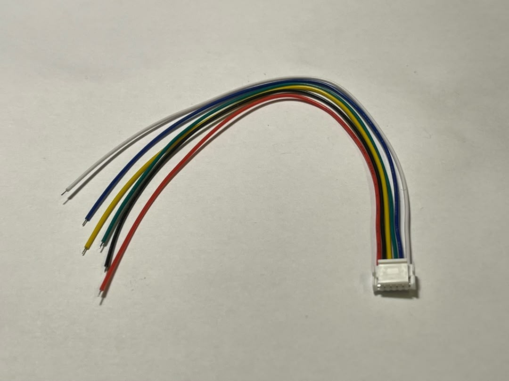
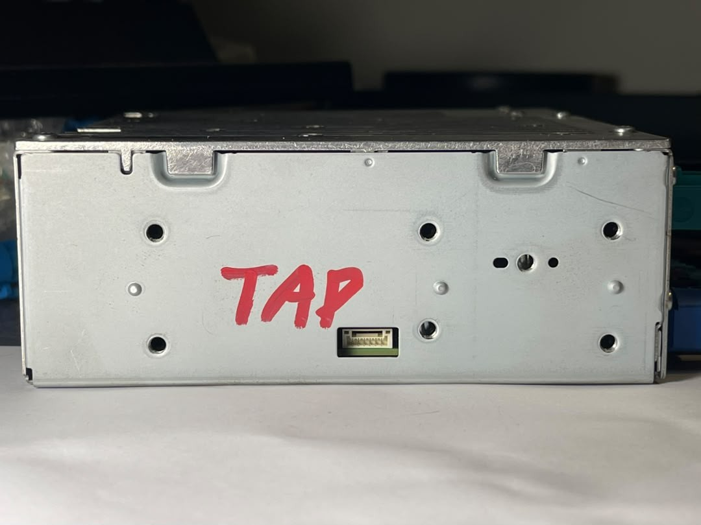
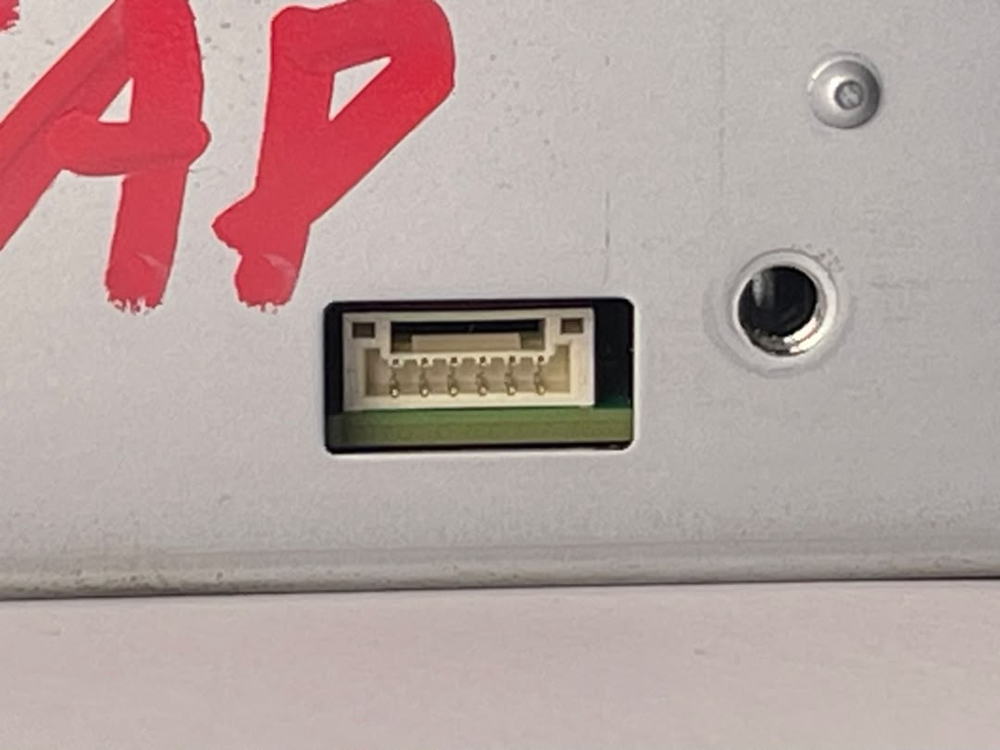
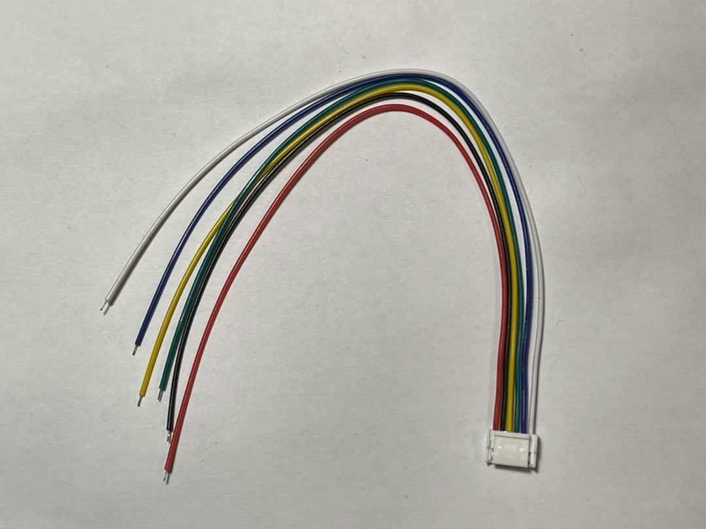
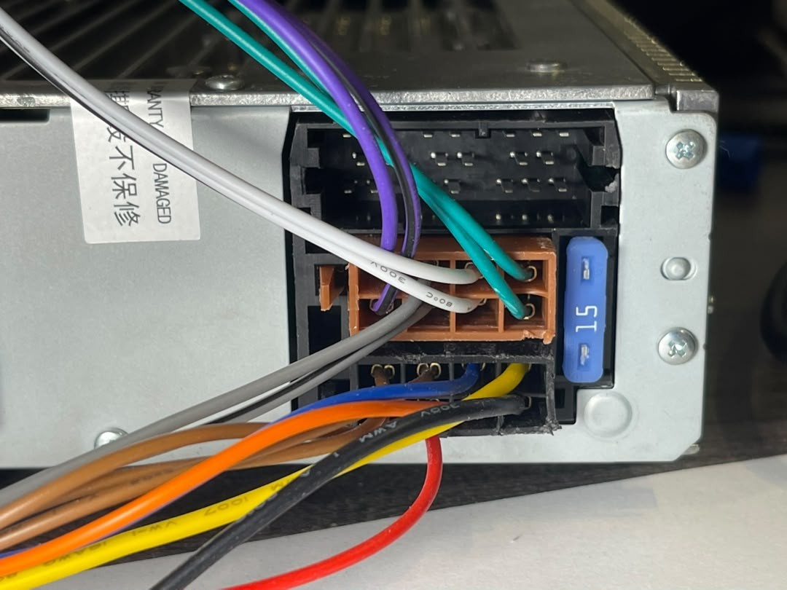
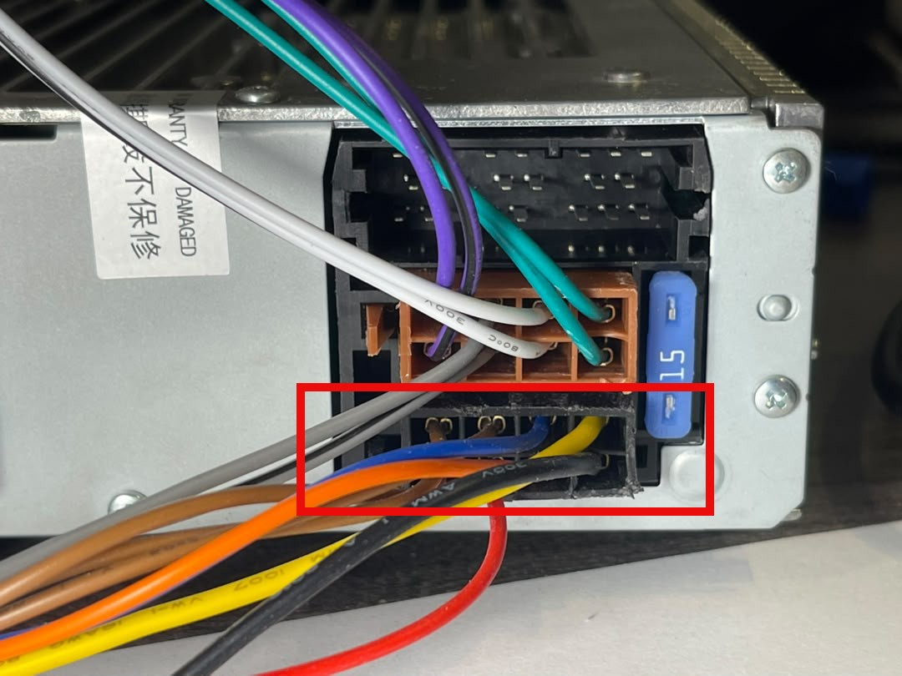
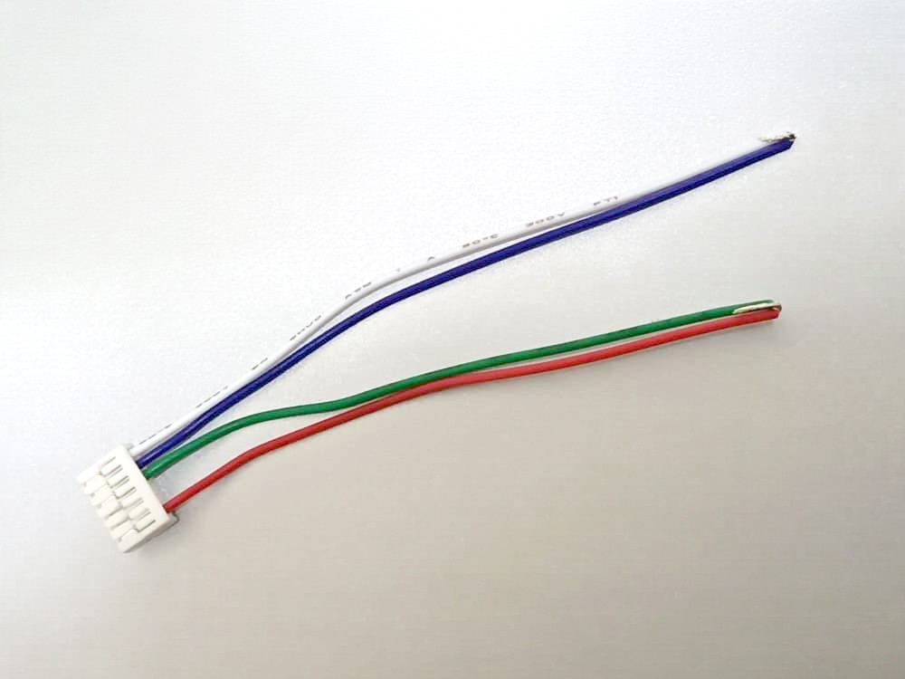
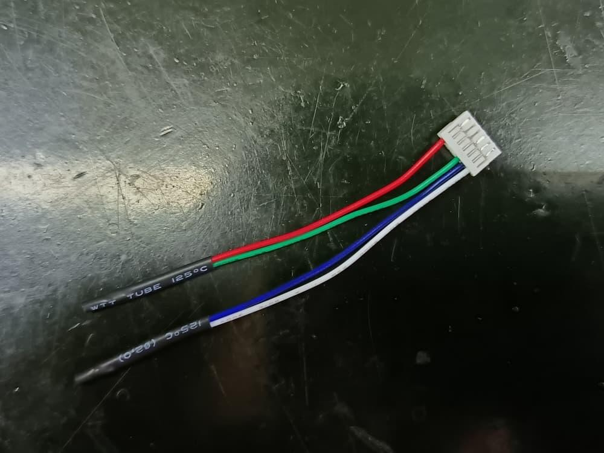
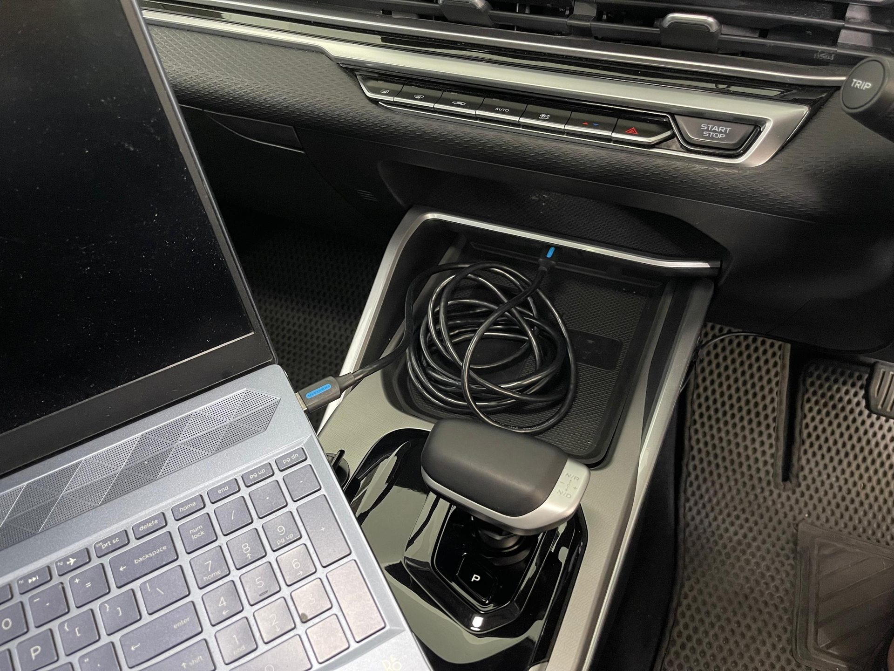
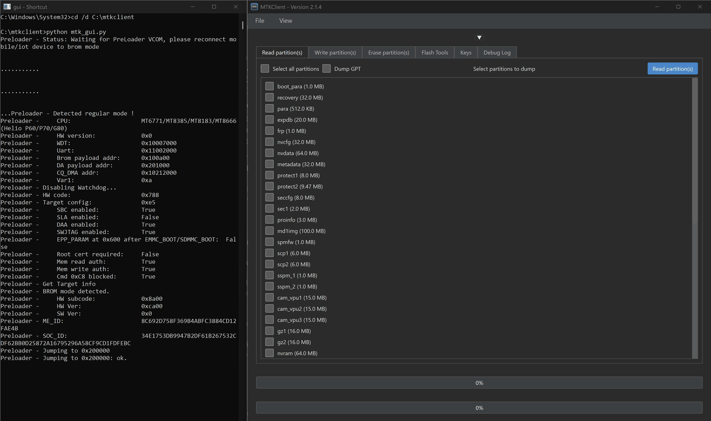

# Install MTKClient from Source on Windows

Get upstream `bkerler/mtkclient` working with an ECarX E02 head unit. The official Windows README gets you most of the way, then leaves you stuck on two things it never mentions: the Python PATH trap on Windows 11, and a bug in the 2.1.4 GUI that loops `Handshake failed, retrying` forever on any device whose USB port does not re-enumerate. This guide fixes both.

**Platform:** Windows 11 · **Source:** bkerler/mtkclient · **Version:** 2.1.4 · **Target:** ECarX E02 (MT6771) · **Time:** ~15 min

---

## Contents

- [Step 0 — Overview](#step-0--overview)
- [Step 1 — What You Need](#step-1--what-you-need)
- [Step 2 — Python & Git](#step-2--python--git)
- [Step 3 — Fix the PATH Trap](#step-3--fix-the-path-trap)
- [Step 4 — Clone & Install](#step-4--clone--install)
- [Step 5 — USB Driver](#step-5--usb-driver)
- [Step 6 — Patch Double-Init](#step-6--patch-the-double-init-bug)
- [Step 7 — Launcher](#step-7--one-click-launcher)
- [Step 8 — Enter BROM](#step-8--enter-brom)
- [Step 9 — Verify](#step-9--verify)
- [Fix Fast](#fix-fast)
- [Project Notes](#project-notes)

---

## Step 0 — Overview

`Read First`

This guide installs the original [bkerler/mtkclient](https://github.com/bkerler/mtkclient) from source on Windows and gets it working with an ECarX E02 head unit. This is the tool you use to dump and flash partitions. Everything else in the sideload workflow assumes it already works.

> [!WARNING]
> **Why not just follow README-WINDOWS.md?** Because it stops short. Follow it exactly and you still hit two walls that have nothing to do with your hardware:
>
> - **Python is installed but Windows cannot find it.** It is not missing — the problem is a PATH checkbox and a Microsoft Store stub, covered in [Step 3](#step-3--fix-the-path-trap).
> - **The GUI connects, reads your chip, then loops forever.** A real bug in `mtk_gui.py` 2.1.4, covered in [Step 6](#step-6--patch-the-double-init-bug). This one costs people whole evenings and gets blamed on bad wiring, a bad cable, or a dead unit.

**What "working" looks like at the end:**

**Output** — The two lines that mean you are done
```text
Preloader - Jumping to 0x200000
Preloader - Jumping to 0x200000: ok.
```

…with the partition list populated in the **Read partition(s)** tab. Anything short of that, see [Fix Fast](#fix-fast).

> [!TIP]
> **What this covers.** This guide gets the tool running and connected. It does not flash anything. Erasing, unlocking and writing partitions belong to the [fast-sideload guide](./sideload.md) — do not run those until this guide finishes cleanly.

## Step 1 — What You Need

`Hardware + Software`

### 1.1 — Software

| Item | Version | Notes |
|---|---|---|
| Python | 3.9 or newer | [python.org/downloads](https://www.python.org/downloads/) — take the latest **Windows installer (64-bit)**. **Not** the Microsoft Store build; see [Step 2](#step-2--python--git) for why that one bites. |
| Git for Windows | any current | [git-scm.com/download/win](https://git-scm.com/download/win) — the **64-bit standalone installer**. Click through with the defaults; none of the options matter here. |
| UsbDk Runtime Libraries | 1.0.22 x64 | [github.com/daynix/UsbDk/releases](https://github.com/daynix/UsbDk/releases) — download `UsbDk_1.0.22_x64.msi`. This is what lets mtkclient claim the BROM USB endpoint. |
| MTKClient source | 2.1.4 or later | [github.com/bkerler/mtkclient](https://github.com/bkerler/mtkclient) — nothing to download by hand; you clone it in [Step 4](#step-4--clone--install). The official Windows notes live in [README-WINDOWS.md](https://github.com/bkerler/mtkclient/blob/main/README-WINDOWS.md). |

Every command in this guide runs in **Command Prompt** — that is what the Windows CMD tag on each block means. Nothing to install; it comes with Windows (`WIN+R` → `cmd` → Enter). **Do not use PowerShell instead.** Windows PowerShell saves redirected output as UTF-16, so the `echo ... > gui.bat` trick in [Step 7](#step-7--one-click-launcher) would make a batch file that cmd cannot run — and the error on screen looks like nonsense instead of something clear.

> [!TIP]
> **Python 3.14 is fine.** Tested on 3.14.0 (64-bit): every dependency — PySide6, unicorn, capstone, keystone-engine — has a prebuilt wheel, so nothing has to compile and you do not need Visual Studio build tools. If a later Python release gets ahead of the wheels, install 3.12 alongside it and run mtkclient with `py -3.12`.

### 1.2 — Hardware (for an ECarX E02)

| Item | Notes |
|---|---|
| USB A-to-A cable (male-to-male) | It has to be a **data** cable. Charge-only cables enumerate nothing and look exactly the same. |
| Micro JST GH 6-pin cable | 1.25 mm pitch, single connector, bare ends. Used for the two shorts in [Step 8](#step-8--enter-brom). |
| A USB 2.0 port | The black ones. On several laptops the BROM handshake is unreliable on USB 3.0 ports — if you have a choice, use USB 2.0. |



*Micro JST GH 6-pin cable, single connector. The connector plugs into the IHU; the bare ends are the ones you short in [Step 8](#step-8--enter-brom). GH series is 1.25 mm pitch — a 6-pin cable from any other JST series will not fit the port.*

## Step 2 — Python & Git

`Windows · cmd`

Open Command Prompt — `WIN+R`, type `cmd`, Enter — and check what you already have:

**Windows CMD** — Check for Python and Git
```bat
python --version
git --version
```

Three outcomes, and they mean different things:

| What you see | Meaning | Do this |
|---|---|---|
| `Python 3.x.x` | Installed and on PATH. | Skip to [Step 4](#step-4--clone--install). |
| `Python was not found; run without arguments to install from the Microsoft Store` | This does **not** mean Python is missing. It is Windows' alias stub answering. Python may well be installed. | Go to [Step 3](#step-3--fix-the-path-trap). |
| `'git' is not recognized` | Git really is missing. | Install from [git-scm.com/download/win](https://git-scm.com/download/win), next-next-finish. |

> [!WARNING]
> **Answer that question first.** Before you reinstall anything, run this:

**Windows CMD** — Ask the Python Launcher instead
```bat
py --version
```

> [!WARNING]
> The `py` launcher does not rely on PATH. If `py --version` prints a version but `python --version` does not, Python is fine and only PATH is broken — do [Step 3](#step-3--fix-the-path-trap), do not reinstall from scratch.

If Python genuinely is not installed, get it from [python.org/downloads](https://www.python.org/downloads/) and **tick "Add python.exe to PATH" on the very first installer screen**. That one checkbox is all of Step 3. Miss it and you will be back here.

## Step 3 — Fix the PATH Trap

`Common Wall #1`

Two separate things go wrong at once here, which is why the error message is so misleading.

- **PATH was never set.** The installer's "Add python.exe to PATH" box is off by default. Python installs fine into `%LOCALAPPDATA%\Programs\Python\Python3xx`, but the command prompt has no idea it is there.
- **Windows has a decoy.** There is a fake `python.exe` in the `WindowsApps` folder whose only job is to send you to the Microsoft Store. It sits early on PATH, so `python` finds *it* instead of finding nothing — and it prints a message about installing Python even when Python is already there.

### 3.1 — Repair the install

1. **Settings → Apps → Installed apps**
2. Find **Python 3.x.x (64-bit)** → the `...` button → **Modify**
3. On **Optional Features**: tick **py launcher**, leave "for all users" unticked. Click **Next**.
4. On **Advanced Options**: tick **Add Python to environment variables**. Leave everything else alone — do not change the install location.
5. **Install**, and wait for it to finish.

> [!CAUTION]
> **Close every open Command Prompt and open a new one.** An open shell keeps the PATH it started with. Test in the same window that failed before and it fails again, sending you after a problem you have already fixed.

**Windows CMD** — In a NEW cmd window
```bat
python --version
pip --version
```

Both should answer. `pip` should report a path inside your Python folder, e.g. `...\Python314\Lib\site-packages\pip`.

### 3.2 — If it still redirects to the Store

The decoy is winning. Turn it off:

1. **Settings → Apps → Advanced app settings → App execution aliases**
2. Find `python.exe` and `python3.exe`
3. Toggle both **Off**
4. New cmd window, test again

## Step 4 — Clone & Install

`Windows · cmd`

Pick a folder with **no spaces in the path**, and not inside any OneDrive-synced folder. Partition dumps run to tens of gigabytes, and you do not want a cloud client trying to sync them.

**Option A — `C:\mtkclient`** (tidy, needs an Administrator cmd because it writes to the drive root):

**Windows CMD · Admin** — Clone and install dependencies
```bat
cd /d C:\
git clone https://github.com/bkerler/mtkclient
cd mtkclient
pip install -r requirements.txt
```

**Option B — your user folder** (no Administrator needed):

**Windows CMD** — Clone into your own profile instead
```bat
cd /d %USERPROFILE%
git clone https://github.com/bkerler/mtkclient
cd mtkclient
pip install -r requirements.txt
```

The rest of this guide uses `C:\mtkclient`. If you picked Option B, use your own path everywhere instead.

The install takes a few minutes. PySide6 alone is about 245 MB. It is done when you see a long `Successfully installed ...` line.

> [!WARNING]
> **Do not worry about the package list.** You will see pip download Flask, SQLAlchemy, `oslo.*`, pysaml2 and a pile of other things that have nothing to do with flashing phones. That is a typo upstream: `requirements.txt` lists `keystone`, and on PyPI that name is **OpenStack Keystone**, an identity service. The package mtkclient really needs is `keystone-engine` (the assembler), which is already listed two lines above. The extra packages do no harm — a few hundred megabytes of disk, nothing more. Leave them.

## Step 5 — USB Driver

`UsbDk`

mtkclient reaches the BROM endpoint through **UsbDk**. Without it the tool starts but never sees a device.

Check whether you already have it: **Settings → Apps → Installed apps**, search `usbdk`. You are looking for **UsbDk Runtime Libraries** (publisher: Red Hat).

If it is missing, download `UsbDk_1.0.22_x64.msi` from the [daynix/UsbDk releases page](https://github.com/daynix/UsbDk/releases) on GitHub and install it. Restart if the installer asks.

> [!TIP]
> If you have ever run a packaged MTKClient build (the prebuilt GUI bundles people share), UsbDk is almost certainly already installed — those bundles include it.

> [!WARNING]
> **One tool at a time.** Two MTKClient instances cannot share one USB device. If you keep a packaged build around, close it fully — and check Task Manager for leftover `python.exe` processes — before you run this one. The GUI's "Error initialising. Did you install the drivers?" line often just means "another process already holds UsbDk".

## Step 6 — Patch the Double-Init Bug

`Common Wall #2`

This step is in no README, and it is the reason this guide exists.

### 6.1 — The symptom

The GUI connects, reads your chip perfectly, and then falls apart:

**Output** — What the broken run looks like
```text
Preloader - Detected regular mode !
Preloader -     CPU:            MT6771/MT8385/MT8183/MT8666(Helio P60/P70/G80)
Preloader - HW code:            0x788
Preloader - Get Target info
Preloader - BROM mode detected.
Preloader - ME_ID:             8C692D75...
Preloader - SOC_ID:            34E1753D...
Preloader - Status: Waiting for PreLoader VCOM, please reconnect mobile/iot device to brom mode
Preloader - [LIB]: Status: Handshake failed, retrying...
Preloader - [LIB]: Status: Handshake failed, retrying...
Preloader - [LIB]: Status: Handshake failed, retrying...
```

> [!CAUTION]
> **Read that log carefully before you touch your wiring.** It got the HW code, the ME_ID and the SOC_ID. Those only come out of a completed BROM handshake. Your shorts are right, your cable is right, your driver is right, your unit is in BROM. Nothing physical is wrong. People rewire their setup for hours over this.

### 6.2 — The cause

In `mtk_gui.py`, the function `getDevInfo()` initialises the preloader — and then hands off to `da_handler.connect()`, which initialises it **again**:

**Reference** — mtk_gui.py — the duplicate call
```python
if not mtk_class.port.cdc.connect():
    mtk_class.preloader.init()          # first init  — succeeds
...
mtk_class = da_handler.connect(mtk_class)   # calls preloader.init() again — cannot succeed
```

The MediaTek BROM accepts its handshake **only once per power-on**. After that it is in command mode and will not answer a handshake again. So the second init can never work — it just retries until you give up.

Most phones get through this by luck: their USB port re-enumerates between the two calls, so the second init meets a fresh BROM. The ECarX E02 does not re-enumerate, so the bug shows up in full. That is also why older 2.0-based builds connect to the same unit, on the same wiring, without trouble.

### 6.3 — The fix

Back up first:

**Windows CMD** — Back up before editing
```bat
copy C:\mtkclient\mtk_gui.py C:\mtkclient\mtk_gui.py.bak
```

Open `C:\mtkclient\mtk_gui.py` in any plain-text editor — Notepad works, though VS Code or Notepad++ make the indentation much easier to see — and search for `mtk_class.preloader.init()`. There is exactly one match, around line 182, inside `getDevInfo()`:

**Before** — mtk_gui.py — as shipped
```python
    try:
        if not mtk_class.port.cdc.connect():
            mtk_class.preloader.init()
        else:
            with lock:
                phone_info['cdcInit'] = True
```

Replace that one line with `pass`:

**After** — mtk_gui.py — patched
```python
    try:
        if not mtk_class.port.cdc.connect():
            pass
        else:
            with lock:
                phone_info['cdcInit'] = True
```

> [!CAUTION]
> **Indentation matters here.** Python counts spaces. `pass` must start in the exact column where `mtk_class.preloader.init()` started — one level deeper than `if`, level with the `with lock:` below. In VS Code the clean way is: click on the line, press **End**, press **Shift+Home** (this selects the code and leaves the leading spaces), then type `pass`.

Save. Keep a copy of the patched file, because `git pull` will overwrite it:

**Windows CMD** — Preserve the patched file across updates
```bat
copy C:\mtkclient\mtk_gui.py C:\mtkclient\mtk_gui.py.patched
```

> [!TIP]
> **Why this is safe.** You are not turning off initialisation — you are removing a duplicate. `da_handler.connect()` still calls `preloader.init()`, so the device is initialised once, which is what the BROM expects. The only thing you lose is the chipset name showing up a second or two earlier in the GUI header.

> [!WARNING]
> **Things that look like the fix but are not.** Giving it a preloader binary — the GUI's blue **Preloader** button, or `--preloader path\to\preloader.bin` on the CLI — does **not** help. It was tested and ruled out. The handshake never gets far enough for the preloader to matter.

## Step 7 — One-Click Launcher

`Optional`

mtkclient needs Administrator for USB access, and it must run from its own folder. A two-line batch file saves you typing that every time.

**Windows CMD** — Create gui.bat from cmd
```bat
cd /d C:\mtkclient
echo cd /d C:\mtkclient> gui.bat
echo python mtk_gui.py>> gui.bat
type gui.bat
```

One `>` creates the file with the first line; two `>>` add the second. `type gui.bat` should print both lines back.

From then on: right-click `gui.bat` → **Run as administrator**. For a desktop shortcut, right-click it → **Show more options** → **Send to** → **Desktop (create shortcut)**.

> [!WARNING]
> If you make the file in Notepad instead, set **Save as type** to **All Files** and put quotes around the name — `"gui.bat"` — or you will quietly end up with `gui.bat.txt`.

## Step 8 — Enter BROM

`ECarX E02`

The E02 is not a phone: there is no test point and no volume-button combo. Everything happens on one small connector on the side of the chassis.

### 8.1 — Find the port



*Where to look: the port sits low on the side panel of the chassis. The red **TAP** marking here is hand-written — your unit will not have it.*



*The same port up close — six pins in a white housing. Count them against the table below before you push the connector in.*

### 8.2 — Pinout

| Pin | Colour | Function | Role in this guide |
|---|---|---|---|
| 1 | White | GND | Short to blue |
| 2 | Blue | Recovery | Short to white (GND) — this is what enters BROM |
| 3 | Green | USB | Short to red (3.3V) — puts the USB port into device mode |
| 4 | Black | UART RX | Not used here |
| 5 | Yellow | UART TX | Not used here |
| 6 | Red | 3.3V | Short to green |



*The six wire colours, matching the table above: white, blue, green, black, yellow, red.*

> [!TIP]
> **Four wires matter here:** white, blue, green and red. Yellow and black are the UART pair — this guide never uses them, so cover their bare ends before you power anything up.

### 8.3 — The two shorts

Two separate shorts, each doing a different job. You need both, at the same time, for the whole session.

| Short | Purpose | When to release |
|---|---|---|
| **White (GND) ↔ Blue (Recovery)** | Puts the SoC into BROM at boot instead of loading the preloader from eMMC. | Keep it in for the whole session. |
| **Green (USB) ↔ Red (3.3V)** | Switches the unit's USB port from host mode into **device** mode, so the PC can see it at all. | Keep it in for the whole session. Let go and the port stops being a device at once. |

> [!CAUTION]
> **Red is a live 3.3 V rail whenever the unit is powered.** If red touches white (GND) it shorts the IHU's 3.3 V supply — the worst thing on this page. Make each short on purpose, to the one wire it belongs to, and cover every bare end you are not using. Never bundle loose ends together "out of the way" — that is exactly how blue meets red.

### 8.4 — Power-up order

BROM is decided the moment the SoC powers up, so both shorts must already be in place before power arrives. This order is not a suggestion — work down the list, do not skip ahead.

- **Disconnect IHU power.** Unplug **Socket Block A — Power**, the black connector at the bottom of the ISO stack. Pulling the socket is what gives you a true cold boot; standby is not enough.

  

  *The ISO connectors as they normally sit, everything still plugged in.*

  

  *Unplug the one in the red box: **Socket Block A — Power**, the black connector at the very bottom of the ISO stack.*

- **Make both shorts on the JST jumper.** White↔blue, and green↔red. Join them properly — twisted and tinned, or soldered. A jumper you have to pinch by hand will let go at the worst moment, and a short that opens mid-session drops the unit straight out of BROM.

  

  *The two joins made: white to blue, green to red. Yellow and black are left off the connector completely — this guide never uses UART, so leaving them off removes any chance of a stray short.*

  

  *The same jumper finished. Each join sits inside **its own** piece of heat shrink, with no copper showing anywhere. This is how it should look before it goes near a powered unit — PVC tape works too if you have no heat gun.*

  > [!CAUTION]
  > **Two ways to get this wrong, and both cost you hardware.**
  >
  > - **Wrong pair.** Red is a live 3.3 V rail whenever the unit is powered. Red touching white shorts the IHU's 3.3 V supply. There are exactly two joins on this jumper — **white↔blue** and **green↔red** — and nothing else may touch. Check the colours twice before the tube goes on, because once it is shrunk you cannot see underneath.
  > - **Bare copper left showing.** A join you tinned but never covered will touch the other pair the first time the cable moves — and it moves every session. Cover each join fully, past the tip, not just over the middle.
  >
  > Sleeve the two joins **on their own**. Wrapping both pairs into one lump of tape, or one length of tube, is exactly how white↔blue ends up touching green↔red.

- **Plug the JST jumper into the IHU port** — the one you located in [8.1](#step-8--enter-brom).

- **Start the GUI.** Right-click `gui.bat` → **Run as administrator**, and leave it at "Waiting for connection" before you go on. The tool must be listening before the unit boots, not after.

- **Plug the POWER socket back in.**

- **Immediately plug the USB A-to-A cable**: IHU USB port → PC USB 2.0 port.

  

  *The A-to-A cable running from the laptop to the car's centre-console USB socket. This is the **only** socket wired to the IHU. Every other USB port in the car only charges and will never enumerate, whatever cable you use.*

> [!WARNING]
> Plug the USB cable into a unit that has already booted and you will catch the preloader only for the couple of seconds it is alive during boot, then lose it. The log reads `Detected regular mode !` followed by the handshake loop — which looks exactly like the [Step 6](#step-6--patch-the-double-init-bug) bug but is not. Power-cycle and follow the order above.

> [!TIP]
> **Check the shorts with a multimeter** if you are unsure — continuity mode, probe white against blue with the jumper fitted. JST GH is 1.25 mm pitch; joints that look fine often are not.

## Step 9 — Verify

`Done When…`

A good connection runs through the preloader info, uploads the Download Agent, and ends on the partition list.

**Output** — A good run, ECarX E02 / MT6771
```text
Preloader - Detected regular mode !
Preloader -     CPU:            MT6771/MT8385/MT8183/MT8666(Helio P60/P70/G80)
Preloader - Disabling Watchdog...
Preloader - HW code:            0x788
Preloader - Target config:      0xe5
Preloader -     SBC enabled:    True
Preloader -     SLA enabled:    False
Preloader -     DAA enabled:    True
Preloader - Get Target info
Preloader - BROM mode detected.
Preloader - ME_ID:             8C692D75...
Preloader - SOC_ID:            34E1753D...
Preloader - Jumping to 0x200000
Preloader - Jumping to 0x200000: ok.
```

In the GUI, the **Read partition(s)** tab should now list the unit's partitions with sizes — `boot_para`, `recovery`, `nvdata`, `metadata` and the rest. That list comes from the device's own GPT, so seeing it means the DA is running and the connection is fully up.



*A finished connection. The console ends on `Jumping to 0x200000: ok.` and the **Read partition(s)** tab is populated straight from the unit's own GPT.*

> [!TIP]
> **Worth writing down.** Your unit's `ME_ID` and `SOC_ID` are printed here and are unique to your hardware. Keep them with your firmware backups.

> [!CAUTION]
> **Stop here.** The tool is installed and connected — that is all this guide set out to do. Erasing, unlocking the bootloader and writing partitions all destroy data and belong to the [fast-sideload guide](./sideload.md) — which starts by backing up every partition, and that backup is your only way back. Unlocking wipes userdata.

## Fix Fast

`Troubleshooting`

Symptoms, in the order you are likely to hit them.

| Symptom | Cause | Fix |
|---|---|---|
| `Python was not found... Microsoft Store` | PATH unset, and the WindowsApps alias stub is answering. | [Step 3](#step-3--fix-the-path-trap). Run `py --version` first to confirm Python itself is fine. |
| Fixed PATH but cmd still fails | The open shell still holds the old PATH. | Close every cmd window and open a new one. PATH is read at launch. |
| `error: externally-managed-environment` | You are in WSL or Linux, not Windows. Ubuntu 24.04 blocks pip from writing to the system Python. | This guide is for native Windows. If you meant to use Linux, create a venv: `python3 -m venv venv && source venv/bin/activate`. |
| `could not create work tree dir` on clone | Writing to `C:\` root without Administrator. | Use an Administrator cmd, or clone into your user folder (Option B in [Step 4](#step-4--clone--install)). |
| pip pulls Flask, SQLAlchemy, oslo.* | Upstream typo: `keystone` in requirements.txt resolves to OpenStack Keystone. | Nothing to fix. Harmless, just disk space. |
| Chip info reads OK, then `Handshake failed, retrying` forever | The double-init bug. Not your wiring. | [Step 6](#step-6--patch-the-double-init-bug). |
| `Error initialising. Did you install the drivers?` | Usually another MTKClient instance or a stray `python.exe` holding UsbDk. | Close all other instances, clear stray processes in Task Manager, relaunch. |
| Nothing detected at all | Green↔red short missing, so the USB port is still in host mode. Or a charge-only cable. | Check both shorts ([Step 8](#step-8--enter-brom)) and swap to a known data cable. |
| Detected, but handshake retries on a USB 3.0 port | BROM handshake timing is unreliable on some USB 3.0 controllers. | Move to a USB 2.0 (black) port. |
| Patch applied, now `IndentationError` | `pass` is in the wrong column. | Restore and retry: `copy C:\mtkclient\mtk_gui.py.bak C:\mtkclient\mtk_gui.py` |
| Worked before, broken after `git pull` | The update overwrote your patch. | Reapply [Step 6](#step-6--patch-the-double-init-bug), or restore `mtk_gui.py.patched`. |

## Project Notes

`Background`

### 1 — Why the BROM only handshakes once

The MediaTek boot ROM starts by listening, waiting for a specific byte sequence on the USB endpoint. Finish that exchange and it moves into command mode, where it accepts the real protocol — read register, get target config, jump to address. There is no way back. It enters the handshake state on power-up and leaves it exactly once.

So a second handshake attempt is not slow or flaky — it simply cannot work. The retry loop runs until you close the tool, and no amount of re-plugging, swapping cables or changing ports helps, because the device is not broken and not gone. It is sitting there in command mode, waiting for commands nobody is sending.

### 2 — Why phones don't hit this

Most phones re-enumerate on the USB bus between the two init calls: the port drops and comes back, Windows re-attaches, and the second `preloader.init()` meets what is basically a fresh connection. The bug is there, it just never shows. Hardware that keeps a steady USB presence — the E02 included — makes it show every single time. That is why the bug survived upstream: on the devices most people test with, you cannot see it.

### 3 — Reading the log correctly

Two lines in the log are easy to misread:

- `Detected regular mode !` does **not** mean "not in BROM". In `mtk_preloader.py` it tells *regular* apart from *iot* mode — it is about the chip family, not the boot state.
- `BROM mode detected.`, a few lines further down, is the line that really tells you the unit is in BROM. `get_blver()` prints it when the bootloader-version command answers the way only a boot ROM does.

If you see `BROM mode detected.`, your hardware is set up right, whatever happens next.

### 4 — What was ruled out

Before the duplicate call was found, these were all tested against the same unit and none of them was the cause: re-seating and checking both JST shorts with a multimeter; every USB port and several data cables; the full power-off-first sequence; giving it the device's own extracted preloader through both the GUI's **Preloader** button and the CLI's `--preloader` flag; running as Administrator; closing other instances. The clincher was that an older 2.0-based build connected to the same setup, wiring and sequence with no trouble — which pointed at the software, not the bench.

### 5 — Version note

Worked out against mtkclient **2.1.4** on Windows 11 with Python 3.14.0, connected to a Proton ECarX E02 (MT6771, HW code `0x788`). If a later release drops the duplicate `preloader.init()` from `getDevInfo()`, Step 6 is no longer needed — check whether the line is still there before you patch. The fix is worth reporting upstream; any device that does not re-enumerate is affected.

### 6 — Keeping the patch through updates

The clean way to keep the patch through `git pull` is to save the change as a commit on a local branch, not as a loose edit:

**Windows CMD** — Optional — track the patch in git
```bat
cd /d C:\mtkclient
git checkout -b e02-fix
git add mtk_gui.py
git commit -m "Remove duplicate preloader.init() in getDevInfo"
```

Then updating is just `git fetch origin && git rebase origin/main`, and git will tell you if upstream changed that part of the file — including if they fixed it themselves.
